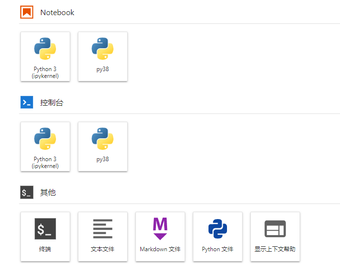
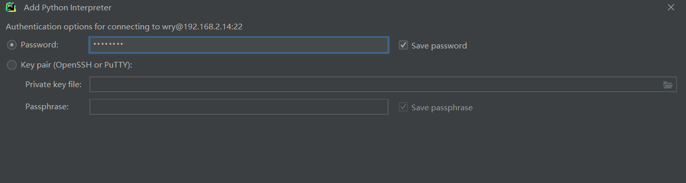

# 创建基于AutoDL的GPU环境

## 配置环境——激活conda


1. 输入：`vim ~/.bashrc`

2. 在最后加上：`source /root/miniconda3/etc/profile.d/conda.sh`

   

3. 重启终端

   

4. 进入环境：`conda activate base`

5. 创建新环境：`conda create -n py38 python=3.8`

6. 进入新环境，输入：`conda activate py38`

## 根据不同框架和GPU的操作

下载pytorch地址：[Previous PyTorch Versions | PyTorch](https://pytorch.org/get-started/previous-versions/)

### miniconda3框架+3090


1. 安装pytorch，输入：`conda install pytorch torchvision torchaudio cudatoolkit=11.3 -c pytorch`
2. 安装其他包，输入：`pip install jupyter d2l`

### miniconda3框架+2080ti


1. 安装pytorch，输入：`conda install pytorch==1.7.0 torchvision==0.8.0 torchaudio==0.7.0 cudatoolkit=10.1 -c pytorch`
2. 安装其他包，输入：`pip install jupyter d2l`

### pytorch框架+2080ti

（base自带pytorch，但是最好用自己创建的py38）


1. 安装pytorch，输入：`conda install pytorch==1.7.0 torchvision==0.8.0 torchaudio==0.7.0 cudatoolkit=11.0 -c pytorch`
2. 安装其他包，输入：`pip install jupyter d2l`

## jupyter页面更新

1. 在py38环境中，输入：`conda install ipykernel`

2. 输入：`ipython kernel install --user --name=py38`



## xftp上传文件


## 测试用例

使用py38内核


## 成功


#  安装Anaconda

[anaconda使用配置说明](https://zhuanlan.zhihu.com/p/58541621)（只做参考）

## 安装Anaconda

（[Index of /anaconda/archive/ | 清华大学开源软件镜像站 | Tsinghua Open Source Mirror](https://mirrors.tuna.tsinghua.edu.cn/anaconda/archive/)）

1. 下载最新版的Anaconda（对python可以向下兼容），点击安装

2. 选择加入path，不选择register anaconda as my default（这样Anaconda用的python和系统无关）

   

## 配置Anaconda

1. 开始 -> anaconda navigator可以成功启动，表明安装成功。

   开始 -> 右键点击anaconda prompt，以管理员身份运行。输入`conda list`，可以查看已经安装的包名和版本号。若结果正常显示，表明安装成功。

2. 点击进入Anaconda Prompt (Anaconda)。

3. 输入`conda --version`，检测conda环境。

   

4. 输入`conda info`，查看是否成功。

   

5. 输入`conda update conda`，更新conda包（国内网络即可）。

6. 输入`conda update --all`，更新所有包（国内网络即可）。

## 构建环境

1. 点击进入Anaconda Prompt (Anaconda)。

2. 输入`conda create -n iec_wry python=3.6.5`，创建基于python3.6.5版本的环境

3. 输入`conda env list`，查看环境列表（环境项目在*D:\Anaconda\envs*下）

   

4. 输入`conda activate iec_wry`，激活环境

**Note：**

1. 如果要删除环境，输入`conda remove -n iec_wry --all`
2. 如果要查找环境下的包，在当前环境下输入`conda list`
3. 如果要安装包，`conda install package_name[=x.x.x]`或者`pip install package_name[=x.x.x]`
4. 如果要更新包，`conda update package_name`或者`pip update package_name`
5. 如果要卸载包，`conda uninstall package_name`或者`pip uninstall package_name`

## 其他问题

### 1. python环境没有激活


#### 解决（必须在base环境下才能使用此python）


### 2. 没有Anaconda Navigator

#### 解决：[开始菜单中找不到anaconda navigator的解决办法](https://blog.csdn.net/qq_39530754/article/details/120693732)


# 安装Ubuntu

## 1. 安装Ubuntu Serve

（[Ubuntu 18.04 LTS Server 版安装图文教程](https://blog.csdn.net/hhd1988/article/details/122552698)）

**注意：使用桥接模式-Realtek PCIe网卡**


## 2. 配置Ubuntu

1. 获取网络信息：192.168.2.14/24（但是端口依然是22）

   

2. 配置镜像源：`http://mirrors.aliyun.com/ubuntu`

   

3. 点击upgrade

3. 配置用户信息

   ==**用户名：wry**==

   ==**密码：admin123**==

   
   
5. 勾选openssh

   

## 3. 配置ssh环境

（[ Ubuntu18配置连接xshell](https://blog.csdn.net/weixin_44246836/article/details/122894088)）

依次输入：`sudo apt install net-tools`		

​						`sudo apt-get install openssh-server` 

​					   `sudo ufw allow 22`

## 4. 连接xshell和xftp

**注意：端口一直为22**


# 安装miniconda3（李沐）

## 配置虚拟机

([用Ubuntu子系统下载安装Miniconda3（小白版）](https://blog.csdn.net/wangcassy/article/details/123578709)，包含多种操作)

1. 输入:`sudo apt update`，更新环境

2. 输入：`sudo apt install build-essential` 

3. 配置python3.8环境，输入：`sudo apt install python3.8`

4. 下载miniconda3，输入：`wget https://mirrors.tuna.tsinghua.edu.cn/anaconda/miniconda/Miniconda3-latest-Linux-x86_64.sh`

5. 安装miniconda3，输入：`bash Miniconda3-latest-Linux-x86_64.sh`

6. 进入base环境，输入：`bash`

7. 安装必要的包，输入：`pip install jupyter d2l torch torchvision`

   （貌似配置了清华源之后不用挂外网）

   （pytorch镜像：`pip install torch torchvision -i http://mirrors.aliyun.com/pypi/simple/  --trusted-host mirrors.aliyun.com`）

   （豆瓣源：`-i http://pypi.douban.com/simple/ --trusted-host pypi.douban.com`）

   （配置清华源：

   ```ubuntu
   conda config --add channels https://mirrors.tuna.tsinghua.edu.cn/anaconda/pkgs/free/
   conda config --add channels https://mirrors.tuna.tsinghua.edu.cn/anaconda/pkgs/main/
   conda config --add channels https://mirrors.tuna.tsinghua.edu.cn/anaconda/cloud/conda-forge/
   conda config --add channels https://mirrors.tuna.tsinghua.edu.cn/anaconda/cloud/bioconda/
   conda config --set show_channel_urls yes
   ```

   ）

   > 清华：https://pypi.tuna.tsinghua.edu.cn/simple
   >
   > 阿里云：https://mirrors.aliyun.com/pypi/simple/
   >
   > 中国科技大学：https://pypi.mirrors.ustc.edu.cn/simple/
   >
   > **pip install xxx -i ......**

8. 下载测试用例：`wget https://zh-v2.d2l.ai/d2l-zh.zip`

9. 下载解压包，输入：

10. 解压，输入：`unzip d2l-zh.zip`

11. 进入pytorch版本，输入：`cd pytorch/`

    退出，输入：`cd ..`

12. 连接git，输入:`git clone https://github.com/d2l-ai/d2l-zh-pytorch-slides`

## 连接虚拟机和本地

1. 开启虚拟机的jupyter，输入：`jupyter notebook`

2. 打开本地cmd，输入：`ssh -L8888:localhost:8888 wry@192.168.2.14`，再输入对应密码

3. 点击虚拟机中的locahost地址，能在本地浏览器中访问虚拟机的jupyter

4. 本地cmd中安装插件，用来解析幻灯片格式，输入：`pip install rise`

   


# 配置环境

## 虚拟环境中创建新环境

1. 创建环境，输入：`conda create -n t1 python=3.6.5`
2. 检测环境，输入：`conda env list`
3. 激活环境，输入：`conda activate t1`

## pycharm连接远程pycharm

1. 进入settings

   

2. 配置设置

   

   

   

3. 配置成功


# Note

## 1. 授权wry进入root文件夹的权限


输入：`sudo chown -R wry:wry /root`

## 2. 进入root环境

输入：`su root`

如果发生错误，提示**Authentication failure**，则按照下面步骤：

1. 输入：`sudo passwd root`

2. 输入：`su`

3. 成功进入root

   


## 3. GPU安装

**（补充：安装英伟达驱动：[CUDA Toolkit 11.6 Update 2 Downloads | NVIDIA Developer](https://developer.nvidia.com/cuda-downloads?target_os=Linux&target_arch=x86_64&Distribution=Ubuntu&target_version=18.04&target_type=deb_local)，将其提供的代码输一遍即可（虽然我失败了......））**

## 4. 配置链接

设置路径，输入： `echo ". /root/miniconda3/etc/profile.d/conda.sh" >> ~/.bashrc`

设置软连接，输入：`sudo ln -s /root/miniconda3/etc/profile.d/conda.sh /etc/profile.d/conda.sh`

（每次进入root账户自动执行，输入：`echo "conda activate" >> ~/.bashrc`）

输入：`source .bashrc`

## 5. 修改python

1. 配置root环境：`sudo passwd root`

2. 进入root环境：`su root`

3. 配置python3.6.5环境

   输入：`sudo apt install python3.6`

   更新系统，输入：`sudo apt-get update`

   执行安装，输入：`sudo apt-get install python3.6`

   输入：`python`

   （如果不全是3.6.5，则继续后面步骤）

   查看python指向，输入`：sudo ls -l /usr/bin | grep python` 

   删除原有python软连接，输入：`sudo rm /usr/bin/python`

   修改python指向python3.6，输入：`sudo ln -s /usr/bin/python3.6 /usr/bin/python`

   更新ppa，输入：`sudo add-apt-repository ppa:deadsnakes/ppa`

   更新系统，输入：`sudo apt-get update`

   安装pip，输入：`sudo apt-get install python3.6-pip`

   建立pip到pip3的软连接，输入：`sudo ln -s /usr/bin/pip3 /usr/bin/pip`

   查看pip版本，输入：`pip --version`

## 6. 注册Nvidia


## 7. 本地安装

安装pytorch（[conda install pytorch安装缓慢的解决办法](https://blog.csdn.net/slatter/article/details/124012000)）

`conda install pytorch==1.7.1 torchvision==0.8.2 torchaudio==0.7.2 cudatoolkit=10.1 `

（pytorch需要单独用install下载，不然会很慢）

`pip install jupyter d2l -i http://pypi.douban.com/simple/ --trusted-host pypi.douban.com` 

挂外网下载


进入jupyter，输入：`jupyter notebook`


