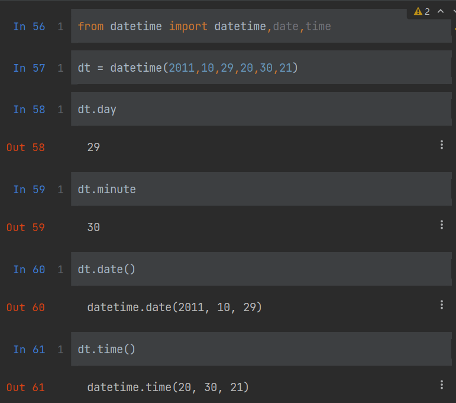
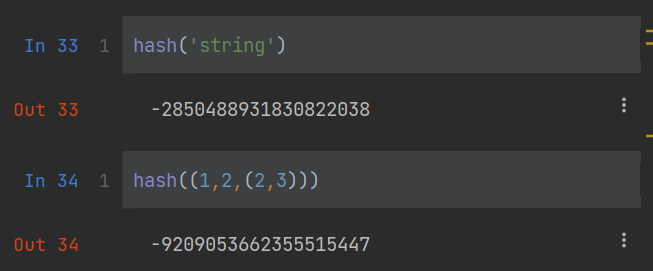
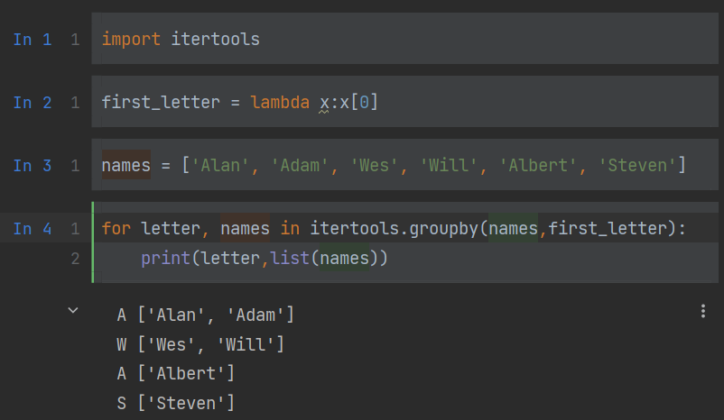
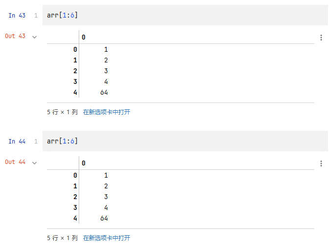
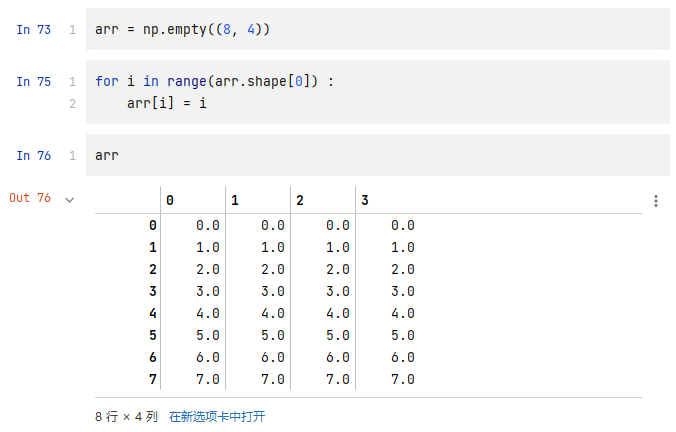
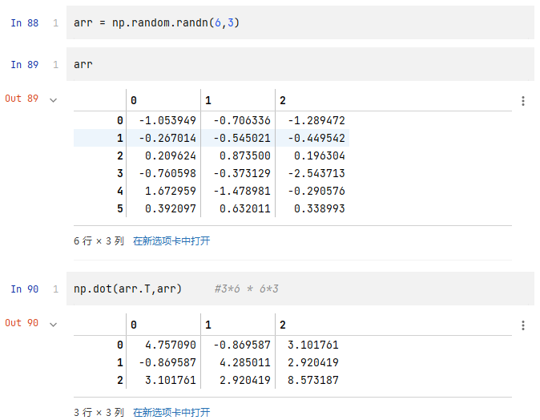

# 基础知识

## NumPy

NumPy（Numerical Python的简称）是Python科学计算的基础包。

- 快速高效的多维数组对象ndarray。

- 用于对数组执行元素级计算以及直接对数组执行数学运算的函数。

- 用于读写硬盘上基于数组的数据集的工具。

- 线性代数运算、傅里叶变换，以及随机数生成。

  -成熟的C API， 用于Python插件和原生C、C++、Fortran代码访问NumPy的数据结构和计算工具。

除了为Python提供快速的数组处理能力，NumPy在数据分析方面还有另外一个主要作用，即作为在算法和库之间传递数据的容器。

对于数值型数据，NumPy数组在存储和处理数据时要比内置的Python数据结构高效得多。此外，由低级语言（比如C和Fortran）编写的库可以直接操作NumPy数组中的数据，无需进行任何数据复制工作。

因此，许多Python的数值计算工具要么使用NumPy数组作为主要的数据结构，要么可以与NumPy进行无缝交互操作。


## pandas

pandas提供了快速便捷处理结构化数据的大量数据结构和函数。自从2010年出现以来，它助使Python成为强大而高效的数据分析环境。本书用得最多的pandas对象是DataFrame，它是一个面向列（column-oriented）的二维表结构，另一个是Series，一个一维的标签化数组对象。

**pandas兼具NumPy高性能的数组计算功能以及电子表格和关系型数据库（如SQL）灵活的数据处理功能。**它提供了复杂精细的索引功能，能更加便捷地完成重塑、切片和切块、聚合以及选取数据子集等操作。因为数据操作、准备、清洗是数据分析最重要的技能，pandas是本书的重点。

有许多工作需求都不能用任何单一的工具解决：

- 有标签轴的数据结构，支持自动或清晰的数据对齐。这可以防止由于数据不对齐，或处理来源不同的索引不同的数据，所造成的错误。
- 集成时间序列功能。
- 相同的数据结构用于处理时间序列数据和非时间序列数据。
- 保存元数据的算术运算和压缩。
- 灵活处理缺失数据。
- 合并和其它流行数据库（例如基于SQL的数据库）的关系操作。

我想只用一种工具就实现所有功能，并使用通用软件开发语言。Python是一个不错的候选语言，但是此时没有集成的数据结构和工具来实现。我一开始就是想把pandas设计为一款适用于金融和商业分析的工具，pandas专注于深度时间序列功能和工具，适用于时间索引化的数据。

对于使用R语言进行统计计算的用户，肯定不会对DataFrame这个名字感到陌生，因为它源自于R的data.frame对象。但与Python不同，data frames是构建于R和它的标准库。因此，pandas的许多功能不属于R或它的扩展包。

pandas这个名字源于panel data（面板数据，这是多维结构化数据集在计量经济学中的术语）以及Python data analysis（Python数据分析）。


## matplotlib

**matplotlib是最流行的用于绘制图表和其它二维数据可视化的Python库。**

它非常适合创建出版物上用的图表。虽然还有其它的Python可视化库，matplotlib却是使用最广泛的，并且它和其它生态工具配合也非常完美。我认为，可以使用它作为默认的可视化工具。


## IPython和Jupyter

IPython项目起初是Fernando Pérez在2001年的一个用以加强和Python交互的子项目。在随后的16年中，它成为了Python数据栈最重要的工具之一。虽然IPython本身没有提供计算和数据分析的工具，它却可以大大提高交互式计算和软件开发的生产率。IPython鼓励“执行-探索”的工作流，区别于其它编程软件的“编辑-编译-运行”的工作流。它还可以方便地访问系统的shell和文件系统。因为大部分的数据分析代码包括探索、试错和重复，IPython可以使工作更快。

2014年，Fernando和IPython团队宣布了Jupyter项目，一个更宽泛的多语言交互计算工具的计划。**IPython web notebook变成了Jupyter notebook**，现在支持40种编程语言。IPython现在可以作为Jupyter使用Python的内核（一种编程语言模式）。

IPython变成了Jupyter庞大开源项目（一个交互和探索式计算的高效环境）中的一个组件。它最老也是最简单的模式，现在是一个用于编写、测试、调试Python代码的强化shell。你还可以使用通过Jupyter Notebook，一个支持多种语言的交互式网络代码“笔记本”，来使用IPython。IPython shell 和Jupyter notebooks特别适合进行数据探索和可视化。

Jupyter notebooks还可以编写Markdown和HTML内容，它提供了一种创建代码和文本的富文本方法。其它编程语言也在Jupyter中植入了内核，好让在Jupyter中可以使用Python以外的语言。

对我个人而言，我的大部分Python工作都要用到IPython，包括运行、调试和测试代码。

你可以找到包含各章节所有代码实例的Jupyter notebooks。


## SciPy

SciPy是一组专门解决科学计算中各种标准问题域的包的集合，主要包括下面这些包：

- scipy.integrate：数值积分例程和微分方程求解器。
- scipy.linalg：扩展了由numpy.linalg提供的线性代数例程和矩阵分解功能。
- scipy.optimize：函数优化器（最小化器）以及根查找算法。
- scipy.signal：信号处理工具。
- scipy.sparse：稀疏矩阵和稀疏线性系统求解器。
- scipy.special：SPECFUN（这是一个实现了许多常用数学函数（如伽玛函数）的Fortran库）的包装器。
- scipy.stats：标准连续和离散概率分布（如密度函数、采样器、连续分布函数等）、各种统计检验方法，以及更好的描述统计法。

NumPy和SciPy结合使用，便形成了一个相当完备和成熟的计算平台，可以处理多种传统的科学计算问题。


## scikit-learn

2010年诞生以来，scikit-learn成为了Python的通用机器学习工具包。仅仅七年，就汇聚了全世界超过1500名贡献者。它的子模块包括：

- 分类：SVM、近邻、随机森林、逻辑回归等等。
- 回归：Lasso、岭回归等等。
- 聚类：k-均值、谱聚类等等。
- 降维：PCA、特征选择、矩阵分解等等。
- 选型：网格搜索、交叉验证、度量。
- 预处理：特征提取、标准化。

与pandas、statsmodels和IPython一起，scikit-learn对于Python成为高效数据科学编程语言起到了关键作用。虽然本书不会详细讲解scikit-learn，我会简要介绍它的一些模型，以及用其它工具如何使用这些模型。


## statsmodels

statsmodels是一个统计分析包，起源于斯坦福大学统计学教授Jonathan Taylor，他设计了多种流行于R语言的回归分析模型。Skipper Seabold和Josef Perktold在2010年正式创建了statsmodels项目，随后汇聚了大量的使用者和贡献者。受到R的公式系统的启发，Nathaniel Smith发展出了Patsy项目，它提供了statsmodels的公式或模型的规范框架。

与scikit-learn比较，statsmodels包含经典统计学和经济计量学的算法。包括如下子模块：

- 回归模型：线性回归，广义线性模型，健壮线性模型，线性混合效应模型等等。
- 方差分析（ANOVA）。
- 时间序列分析：AR，ARMA，ARIMA，VAR和其它模型。
- 非参数方法： 核密度估计，核回归。
- 统计模型结果可视化。

statsmodels更关注与统计推断，提供不确定估计和参数p-值。相反的，scikit-learn注重预测。

同scikit-learn一样，我也只是简要介绍statsmodels，以及如何用NumPy和pandas使用它。


# jupyter使用基础

## random.randn()

[numpy.random.randn()](https://blog.csdn.net/u012149181/article/details/78913167)


## 自省


## %run自动运行


## 快捷方式


## 魔术命令


魔术命令是在指令前添加百分号%前缀。例如，可以用`%timeit`（这个命令后面会详谈）测量任何Python语句，例如矩阵乘法，的执行时间。

> numpy.random.randn(d0,d1,…,dn)
>
> - randn函数返回一个或一组样本，具有标准正态分布。
> - dn表格每个维度
> - 返回值为指定维度的array


魔术函数默认可以不用百分号，只要没有变量和函数名相同。这个特点被称为“自动魔术”，可以用`%automagic`打开或关闭。

一些魔术函数与Python函数很像，它的结果可以赋值给一个变量：


## 集成Matplotlib

> IPython在分析计算领域能够流行的原因之一是它非常好的集成了数据可视化和其它用户界面库，比如matplotlib。
>
> `%matplotlib`魔术函数配置了IPython shell和Jupyter notebook中的matplotlib。
>
> **在jupyter中，使用的命令是：`%matplotlib inline`**


# python使用基础

## isinstance函数检查对象类型

`isinstance`函数检查对象是某个类型的实例


`isinstance`可以用类型元组，检查对象的类型是否在元组中：


## 引入


如果想从同目录下的另一个文件访问`some_module.py`中定义的变量和函数，可以：


或者：


使用`as`关键词，你可以给引入起不同的变量名：


## 运算符

要判断两个引用是否指向同一个对象，可以使用`is`方法。`is not`可以判断两个对象是不同的。

`list`总是创建一个新的Python列表（即复制），我们可以断定c是不同于a的。

使用`is`比较与`==`运算符不同。


`is`和`is not`常用来判断一个变量是否为`None`，因为只有一个`None`的实例：


## 可变对象和不可变对象

列表、字典、NumPy数组、用户定义的类型（类），都是可变的。


**字符串**、元组，是不可变的。


**字符串可以通过转为list列表形式，进行修改**


## 标量类型


> 没有double，只有float
>
> 
>
> int可以存储任意大的数
>
> 
>
> 整数与整数之间的除法可能会得到浮点数
>
> C风格的整数之间的除法用//

## 字符串

如果字符串中包含许多反斜杠，但没有特殊字符可以在字符串前面加一个r，表明字符就是它自身：


format方法

> - `{0:.2f}`表示格式化第一个参数为**带有两位小数的浮点数**。
> - `{1:s}`表示格式化第二个参数为**字符串**。
> - `{2:d}`表示格式化第三个参数为一个**整数**。


## 编码与解码

`encode`将这个Unicode字符串编码为UTF-8：


`decode`方法可以解码：


## 日期和时间

Python内建的`datetime`模块提供了`datetime`、`date`和`time`类型。

`datetime`类型结合了`date`和`time`。



`strftime`方法可以将datetime格式化为字符串：


`strptime`可以将字符串转换成`datetime`对象：


`replace`替换分和秒，因为`datetime.datetime`是不可变类型，此方法会产生新的对象。


两个datetime对象的差会产生一个`datetime.timedelta`类型：

> 结果`timedelta(17, 7179)`指明了`timedelta`将17天、7179秒的编码方式。


将`timedelta`添加到`datetime`，会产生一个新的偏移`datetime`：


## 控制流

### if、elif、else

### for

for循环是在一个**集合{}**（**列表[]**或**元组()**）中进行迭代，或者就是一个迭代器。

如果集合或迭代器中的元素序列（元组或列表），可以用for循环将其方便地拆分成变量：

```python
for a, b, c in iterator:
```

### while

### pass

## range

range函数返回一个迭代器，它产生一个均匀分布的整数序列：


range的三个参数是（起点，终点，步进）：

> 终点取不到


range迭代：

```python
seq = [1, 2, 3, 4]
for i in range(len(seq)):
    val = seq[i]
```

虽然range可以产生任意大的数，但任意时刻耗用的内存却很小。

```python
#对0到99999中3或5的倍数求和
sum = 0
for i in range(100000):
    if i % 3 == 0 or i % 5 == 0:
        sum += i
```

## 三元表达式

三元表达式可以将if-else语句放到一行里：

```python
value = true-expr if condition else false-expr
```

等效于：

```python
if condition:
    value = true-expr
else:
    value = false-expr
```

三元表达式中的if和else可以包含大量的计算，但只有True的分支会被执行。

## 数据结构

### 元组()

元组是一个固定长度，不可改变的Python序列对象。


当用复杂的表达式定义元组，最好将值放到圆括号内


**`tuple()`可以将任意序列、迭代器（如字符串）转为元组**


元组中存储的对象可能是可变对象。

**一旦创建了元组，元组中的对象就不能修改了**

**如果元组中的某个对象是可变的，比如列表，可以在原位进行修改**


可以用加号运算符将元组串联起来，对象本身并没有被复制，只是引用了它


#### 拆分元组


变量替换


**变量拆分常用来迭代元组或列表序列：**


高级元组拆分功能，允许从元组的开头“摘取”几个元素。

它使用了特殊的语法`*rest`，这也用在函数签名中以抓取任意长度列表的位置参数：


`count()`可以统计某个值得出现频率（也适用于列表）


### 列表[]

与元组对比，列表的长度可变、内容可以被修改。你可以用方括号定义，或用`list()`函数


`list`函数常用来在数据处理中实体化迭代器或生成器


#### 添加元素

`append`在列表末尾添加元素

`insert`可以在特定的位置插入元素，插入的序号必须在0和列表长度之间：

> 警告：与`append`相比，`insert`耗费的计算量大，因为对后续元素的引用必须在内部迁移，以便为新元素提供空间。如果要在序列的头部和尾部插入元素，你可能需要使用`collections.deque`，一个双尾部队列。


#### 删除元素

`insert`的逆运算是`pop`，它移除并返回指定位置的元素

可以用`remove`去除某个值，`remove`会先寻找第一个值并除去：


#### 查找元素

用`in`可以检查列表是否包含某个值，否定`in`可以再加一个not：：


#### 组合元素


`extend()`追加多个元素

> 通过加法将列表串联的计算量较大，因为要新建一个列表，并且要复制对象。
>
> 用`extend`追加元素，尤其是到一个大列表中，更为可取。


```python
everything = []
for chunk in list_of_lists:
    everything.extend(chunk)
```

要比串联的方法更快

```python
everything = []
for chunk in list_of_lists:
    everything = everything + chunk
```

#### 排序sort()

将一个列表原地排序（不创建新的对象）


`sort()`有一些选项，有时会很好用。其中之一是二级排序key，可以用这个key进行排序。


#### sorted()函数

`sorted`函数可以从任意序列的元素返回一个新的排好序的列表


> sort和sorted()的区别
>
> 1. **sort()**：仅作用于list对象，没有返回值，修改对象本身；
>
> 2. **sorted()**：作用于所有可迭代对象，返回新的排序对象，不修改原对象；
>
> 3. **sort()**函数不需要复制原有列表，消耗的内存较少，效率也较高；
>
> 4. **sorted()**函数功能强大，使用的范围更为广泛。

#### reversed函数

> `reversed`可以从后向前迭代一个序列
>
> `reversed`是一个生成器，只有实体化（即列表或for循环）之后才能创建翻转的序列。


#### 二分查找bisect

`bisect`模块支持二分查找，和向已排序的列表插入值。

`bisect.bisect`可以找到插入值后仍保证排序的位置。

`bisect.insort`是向这个位置插入值。

> 注意：`bisect`模块不会检查列表是否已排好序，
>
> 进行检查的话会耗费大量计算。
>
> 因此，对未排序的列表使用`bisect`不会产生错误，但结果不一定正确。


#### 切片

切片的起始元素是包括的，不包含结束元素。

切片的基本形式是在方括号中使用`start:stop`。

切片的起始元素是包括的，不包含结束元素。

结果中包含的元素个数是`stop - start`。


`start`或`stop`都可以被省略，省略之后，分别默认序列的开头和结尾

负数表明从后向前切片（生成的个数为`stop - start`）


在第二个冒号后面使用`step`，可以隔一个取一个元素


使用`-1`，它可以将列表或元组颠倒过来


#### enumerate函数

迭代一个序列时，如果想跟踪当前项的序号

手动方法：

```python
i = 0
for value in collection:
	i += 1
```

使用python内置`enumerate()`函数方法，返回`(i, value)`元组：

```python
for i, value in enumerate(collection):
```

例：

> 默认第一个为i，即为自增元素


#### zip函数

`zip`可以将多个列表、元组或其它序列成对组合成一个元组列表

### 字典{}

字典可能是Python最为重要的数据结构。

它更为常见的名字是**哈希映射**或**关联数组**。

它是键值对的大小可变集合，键和值都是Python对象。

创建字典的方法之一是使用尖括号，用冒号分隔键和值。

可以像访问列表或元组中的元素一样，访问、插入或设定字典中的元素。

可以用`in`检查字典中是否包含某个键

可以用`del`关键字或`pop`方法（返回值的同时删除键）删除值

```python
del d1[5]
```

```python
ret = d1.pop('dummy')
```

`keys`和`values`是字典的键和值的迭代器方法。虽然键值对没有顺序，这两个方法可以用相同的顺序输出键和值


用`update`方法可以将一个字典与另一个融合

> `update`方法是原地改变字典，因此任何传递给`update`的键的旧的值都会被舍弃。


#### 用两个序列创建字典

方法一：

```python
mapping = {}
for key, value in zip(key_list, value_list):
	 mapping[key] = value
```

因为字典本质上是2元元组的集合，dict可以接受2元元组的列表：

```python
mapping = dict(zip(range(5), reversed(range(5))))
```

> 不能用list列表，只能用元组，zip()生成的是元组


#### 默认值

`dict`的方法`get`和`pop`可以取默认值进行返回

```python
if key in some_dict:
    value = some_dict[key]
else:
    value = default_value
```

上面可以简写为：

```python
value = some_dict.get(key, default_value)
```

get默认会返回None，如果不存在键，pop会抛出一个例外。

关于设定值，常见的情况是在字典的值是属于其它集合，如列表。


使用setdefault()优化：


#### 可哈希性

字典的值可以是任意Python对象，而键通常是不可变的标量类型（整数、浮点型、字符串）或元组（元组中的对象必须是不可变的）。这被称为“可哈希性”。

可以用`hash()`函数检测一个对象是否是可哈希的（可被用作字典的键）。



要用列表当做键，**一种方法是将列表转化为元组**，只要内部元素可以被哈希，它也就可以被哈希：


> `tuple()`可以将任意序列、迭代器（如字符串）转为元组


### 集合{}

集合是无序的不可重复的元素的集合。

可以把它当做字典，但是**只有键没有值**。

可以用两种方式创建集合：通过`set`()函数或使用尖括号set语句。


集合支持合并、交集、差分和对称差等数学集合运算。

> 合并是取两个集合中不重复的元素。可以用`union`方法，或者`|`运算符。
>
> 交集的元素包含在两个集合中。可以用`intersection`或`&`运算符。
>
> 


所有逻辑集合操作都有另外的原地实现方法，可以直接用结果替代集合的内容。


与字典类似，集合元素通常都是不可变的。要获得类似列表的元素，必须转换成元组。

> 转换成元组：`tuple()`函数


检测一个集合是否是另一个集合的子集或父集。


集合的内容相同时，集合才对等。


## 列表、集合和字典推导式

它允许用户方便的从一个集合过滤元素，形成列表，在传递参数的过程中还可以修改元素。

```python
result = []
for val in collection:
	if condition:
		result.append(expr)
```

等效于使用列表推导式：

### 列表推导式

```python
[expr for val in collection if condition]
```

例：

给定一个字符串列表，我们可以过滤出长度在2及以下的字符串，并将其转换成大写。


与此相似，还可以推导集合和字典。

### 字典推导式

```python
dict_comp = {key-expr : value-expr for value in collection if condition}
```

例：

创建一个字符串的查找映射表以确定它在列表中的位置。

> 迭代一个序列时，如果想跟踪当前项的序号，使用python内置`enumerate()`函数方法，返回`(i, value)`元组：
>
> ```python
> for i, value in enumerate(collection):
> ```


### 集合推导式

```python
set_comp = {expr for value in collection if condition}
```

例：

只想要得到字符串的长度。


### 嵌套列表推导式

例1：

想用一个列表包含所有的名字，这些名字中包含两个或更多的e。


等效于嵌套列表推导式，**for表达式的顺序是与嵌套for循环的顺序一样（而不是列表推导式的顺序）**：


```python
result = [name for names in all_data for name in names if name.count('e') >= 2]
```

例2：

将一个整数元组的列表扁平化成了一个整数列表。


拓：


## 函数

函数参数的主要限制在于：关键字参数必须位于位置参数（如果有的话）之后。

函数可以返回多个值。（数据分析和其他科学计算应用中会常常这么干）

该函数其实只返回了一个对象，也就是一个元组，最后该元组会被拆包到各个结果变量中。

```python
def f():
    a = 5
    b = 6
    c = 7
    return a, b, c

a, b, c = f()
```

```python
return_value = f()     #返回一个元组
```

```python
#最常用
def f():
    a = 5
    b = 6
    c = 7
    return {'a' : a, 'b' : b, 'c' : c}
```

### re模块

为了得到一组能用于分析工作的格式统一的字符串，需要做很多事情：去除空白符、删除各种标点符号、正确的大写格式等。

做法之一是使用内建的字符串方法和正则表达式`re`模块。

> ```python
> def sub(pattern, repl, string, count=0, flags=0):
> 	return _compile(pattern, flags).sub(repl, string, count)
> ```
>
> （1）pattern：该参数表示正则中的模式字符串；
> （2）repl：该参数表示要替换的字符串（即匹配到pattern后替换为repl），也可以是个函数；
> （3）string：该参数表示要被处理（查找替换）的原始字符串；
>
> --------------------------------------------------------下面为可选参数
>
> （4）count：可选参数，表示是要替换的最大次数，而且必须是非负整数，该参数默认为0，即所有的匹配都会被替换；
> （5）flags：可选参数，表示编译时用的匹配模式（如忽略大小写、多行模式等），数字形式，默认为0。

> `str.join(item)`
>
> str表示字符串（字符），item表示一个成员，注意括号里必须只能有一个成员。
>
> 例：将字符串abc中的每个成员以字符','分隔开再拼接成一个字符串
>
> ```python
> ','.join('abc')    #'a,b,c'
> ```
>
> join里放列表、元组、字典也是可以的
>
> ```python
> ';'.join([a,b,c])    #'a;b;c'
> ```

> `str.strip([chars]);`
>
> strip() 方法用于移除字符串**头尾**指定的字符（默认为空格或换行符）或字符序列。
>
> chars -- 移除字符串头尾指定的字符序列。
>
> 返回移除字符串头尾指定的字符生成的新字符串。

> `re.split(pattern, string[, maxsplit=0, flags=0])`
>
> pattern:匹配的字符串
> string:需要切分的字符串
> maxsplit:分隔次数，默认为0(即不限次数)
> flags:标志位，用于控制正则表达式的匹配方式
>
> ```python
> line = 'aaa bbb ccc;ddd   eee,fff'
> re.split(r';',line)    
> #['aaa bbb ccc', 'ddd\teee,fff']
> re.split(r'[;,]',line)  
> #['aaa bbb ccc', 'ddd\teee', 'fff']
> re.split(r'[;,\s]',line)  
> #['aaa', 'bbb', 'ccc', 'ddd', 'eee', 'fff']
> 
> ```
>
> 可以用此方法消除空格
>
> 

> **消除空格的多种方法**
>
> 消除首位空格：
>
> `str.strip();`
>
> 消除中间多个空格：
>
> 方法一：使用`split()`方法，再使用`join()`方法组合
>
> 
>
> 方法二：使用re的`split()`方法，再使用`join()`方法组合
>
> 


### lambda函数（见PythonStudy模块）

它仅由单条语句组成，该语句的结果就是返回值。

它是通过lambda关键字定义的，这个关键字没有别的含义，仅仅是说“我们正在声明的是一个匿名函数”。

它们在数据分析工作中非常方便，因为很多数据转换函数都以函数作为参数的。

直接传入lambda函数比编写完整函数声明要少输入很多字（也更清晰），甚至比将lambda函数赋值给一个变量还要少输入很多字。

### 生成器

能以一种一致的方式对序列进行迭代（比如列表中的对象或文件中的行）是Python的一个重要特点。

这是通过一种叫做迭代器协议（iterator protocol，它是一种使对象可迭代的通用方式）的方式实现的，一个原生的使对象可迭代的方法。

迭代器是一种特殊对象，它可以在诸如for循环之类的上下文中向Python解释器输送对象。

大部分能接受列表之类的对象的方法也都可以接受任何可迭代对象。比如min、max、sum等内置方法以及list、tuple等类型构造器。

生成器（generator）是构造新的可迭代对象的一种简单方式。

**一般的函数执行之后只会返回单个值，而生成器则是以延迟的方式返回一个值序列，即每返回一个值之后暂停，直到下一个值被请求时再继续。**

要创建一个生成器，只需将函数中的return替换为yeild即可。

### 生成器表达式

### itertools模块

标准库itertools模块中有一组用于许多常见数据算法的生成器。

`groupby()`可以接受任何序列和一个函数。它根据函数的返回值对序列中的连续元素进行分组。




## 错误和异常处理（见PythonStudy模块）

## 文件（见PythonStudy-8.20-study6）

为了打开一个文件以便读写，可以使用内置的`open()`函数以及一个相对或绝对的文件路径：


默认情况下，文件是以只读模式（'r'）打开的。


文件操作完需要`close()`


打开时设置操作权限


# NumPy基础

NumPy（Numerical Python的简称）是Python数值计算最重要的基础包。大多数提供科学计算的包都是用NumPy的数组作为构建基础。

NumPy（Numerical Python的简称）是Python数值计算最重要的基础包。大多数提供科学计算的包都是用NumPy的数组作为构建基础。

NumPy的部分功能如下：

- ndarray，一个具有矢量算术运算和复杂广播能力的快速且节省空间的多维数组。
- 用于对整组数据进行快速运算的标准数学函数（无需编写循环）。
- 用于读写磁盘数据的工具以及用于操作内存映射文件的工具。
- 线性代数、随机数生成以及傅里叶变换功能。
- 用于集成由C、C++、Fortran等语言编写的代码的A C API。

NumPy本身并没有提供多么高级的数据分析功能，理解NumPy数组以及面向数组的计算将有助于更加高效地使用诸如pandas之类的工具。

对于大部分数据分析应用而言，我最关注的功能主要集中在：

- 用于数据整理和清理、子集构造和过滤、转换等快速的矢量化数组运算。
- 常用的数组算法，如排序、唯一化、集合运算等。
- 高效的描述统计和数据聚合/摘要运算。
- 用于异构数据集的合并/连接运算的数据对齐和关系型数据运算。
- 将条件逻辑表述为数组表达式（而不是带有if-elif-else分支的循环）。
- 数据的分组运算（聚合、转换、函数应用等）。

虽然NumPy提供了通用的数值数据处理的计算基础，但大多数读者可能还是想将pandas作为统计和分析工作的基础，尤其是处理表格数据时。pandas还提供了一些NumPy所没有的领域特定的功能，如时间序列处理等。

NumPy之于数值计算特别重要的原因之一，是因为它可以高效处理大数组的数据。这是因为：

- NumPy是在一个连续的内存块中存储数据，独立于其他Python内置对象。NumPy的C语言编写的算法库可以操作内存，而不必进行类型检查或其它前期工作。比起Python的内置序列，NumPy数组使用的内存更少。
- NumPy可以在整个数组上执行复杂的计算，而不需要Python的for循环。

考察一个包含一百万整数的数组，和一个等价的Python列表，各个序列分别乘以2：


基于NumPy的算法要比纯Python快10到100倍（甚至更快），并且使用的内存更少。

## ndarray

NumPy的ndarray，是一种多维数组对象。

NumPy最重要的一个特点就是其**N维数组对象**（即ndarray），该对象是一个快速而灵活的大数据集容器。

可以利用这种数组对整块数据执行一些数学运算，其语法跟标量元素之间的运算一样。

> 使用标准的NumPy惯用法`import numpy as np`，当然也可以在代码中使用`from numpy import *`，但不建议这么做。
>
> `numpy`的命名空间很大，包含许多函数，其中一些的名字与Python的内置函数重名（比如min和max）。


可以进行数学运算：


ndarray是一个通用的同构数据多维容器，即其中的所有元素必须是相同类型的。

每个数组都有一个`shape`（一个表示各维度大小的元组）和一个`dtype`（一个用于说明数组数据类型的对象）：


> 虽然大多数数据分析工作不需要深入理解NumPy，但是精通面向数组的编程和思维方式是成为Python科学计算牛人的一大关键步骤。

### 创建ndarray

创建数组最简单的办法就是使用`array()`函数。

它接受一切序列型的对象（包括其他数组），然后产生一个新的含有传入数据的NumPy数组（一维数组是竖着的）：


嵌套序列（比如由一组等长列表组成的列表）将会被转换为一个多维数组：


因为data2是列表的列表，NumPy数组arr2的两个维度的shape是从data2引入的。可以用属性`ndim`和`shape`验证：

> `行数 = arr2.shape[0]`


`zeros()`和`ones()`分别可以创建指定长度或形状的全0或全1数组：


`empty()`可以创建一个没有任何具体值的数组：


`arange()`是Python内置函数`range()`的数组版：


### ndarray的数据类型

如果没有特别指定，数据类型基本都是float64（浮点数）


`astype()`方法将一个数组从一个dtype转换成另一个dtype


如果将浮点数转换成整数，则小数部分将会被截取删除：


如果某字符串数组表示的全是数字，也可以用astype将其转换为数值形式：


> 注意：使用numpy.string_类型时，一定要小心，因为NumPy的字符串数据是大小固定的，发生截取时，不会发出警告。pandas提供了更多非数值数据的便利的处理方法。

> 调用astype总会创建一个新的数组（一个数据的备份），即使新的dtype与旧的dtype相同。

### NumPy数组的运算

数组很重要，因为它使你不用编写循环即可对数据执行批量运算。NumPy用户称其为矢量化（vectorization）。

大小相等的数组之间的任何算术运算都会将运算应用到元素级：


数组与标量的算术运算会将标量值传播到各个元素：


大小相同的数组之间的比较会生成布尔值数组：


不同大小的数组之间的运算叫做广播（broadcasting）。

### 索引和切片


数组切片是原始数组的视图。这意味着数据不会被复制，视图上的任何修改都会直接反映到源数组上。

> 修改了切片之后，原数组也会有相应的修改。


切片[ : ]会给数组中的所有值赋值：


**注意：如果想要得到的是ndarray切片的一份副本而非视图，就需要明确地进行复制操作，例如`arr[5:8].copy()`。**


可以对各个元素进行递归访问，但这样需要做的事情有点多。

可以传入一个以逗号隔开的索引列表来选取单个元素。以下两种方式等价：


在多维数组中，如果省略了后面的索引，则返回对象会是一个维度低一点的ndarray（它含有高一级维度上的所有数据）。


标量值和数组都可以被赋值给arr3d[0]：


arr3d[1,0]可以访问索引以(1,0)开头的那些值（以一维数组的形式返回）：


### 切片索引

#### 一维切片索引：



#### 二维切片索引：

> 表达式`arr2d[:2]`可以被认为是“选取arr2d的前两行”。


可以一次传入多个切片：

`arr2d[:2, 1:]`表示前两行，第二列及其之后的列：


可以选择第三列的前两行：


对切片表达式的赋值操作也会被扩散到整个选区：


### 布尔类型索引

假设有一个用于存储数据的数组以及一个存储姓名的数组（含有重复项）。

在这里，我将使用numpy.random中的`randn()`函数生成一些正态分布的随机数据：


假设每个名字都对应**data数组**中的一行，而我们想要选出对应于名字"Bob"的所有行。

跟算术运算一样，数组的比较运算（如==）也是矢量化的。

因此，对names和字符串"Bob"的比较运算将会产生一个布尔型数组：

> 注意：如果布尔型数组的长度不对，布尔型选择就会出错，因此一定要小心。


索引列实例：


要选择除"Bob"以外的其他值，既可以使用不等于符号`!=`，也可以通过`~`对条件进行否定：


`~`的其他应用：


选取这三个名字中的两个需要组合应用多个布尔条件，使用&（和）、|（或）之类的布尔算术运算符即可：


> 注意：Python关键字and和or在布尔型数组中无效。要使用&与|。

通过布尔型数组设置值是一种经常用到的手段：


通过一维布尔数组设置整行或列的值：


### 花式索引

指的是利用整数数组进行索引。

无论数组是多少维的，花式索引总是一维的。



为了以特定顺序选取行子集，只需传入一个用于指定顺序的整数列表或ndarray即可：


一次传入多个索引数组，它返回的是一个一维数组，其中的元素对应各个索引元组：


例：取arr的1、5、7、2行，再取所有行的0、3、1、2列


**花式索引跟切片不一样，它总是将数据复制到新数组中。**

### 数组转置和轴对换

转置是重塑的一种特殊形式，它返回的是源数据的视图（不会进行任何复制操作）。

数组不仅有transpose方法，还有一个特殊的T属性：


利用`np.dot`计算矩阵内积:



对于高维数组，`transpose`需要得到一个由轴编号组成的元组才能对这些轴进行转置：

> **X轴用0表示，Y轴用1表示，Z轴用2表示……**
>
> 要十分注意：
>
> 
>
> **轴0区分的是两个2维向量，轴1区分的是三个1维行向量，轴2区分的是三个1维列向量**

> `arr.transpose((1,0,2))`表示将轴0和轴1对调，费脑子😶‍🌫️


ndarray还有一个`swapaxes`方法，它需要接受一对轴编号，这两个轴将会对调

> swapaxes也是返回源数据的**视图**


## 通用函数

### 接受一个数组

`sqrt()`函数：求平方根

`exp()`函数：求e为底的指数函数


### 接受两个数组

`np.maximum(x,y)`：计算了x和y中元素级别最大的元素


`modf()`：会返回浮点数数组的小数和整数部分：


## 利用数组进行数据处理

### 矢量化

用数组表达式代替循环的做法，通常被称为矢量化。

矢量化数组运算要比等价的纯Python方式快上一两个数量级（甚至更多），尤其是各种数值计算。

例：计算函数`sqrt(x^2+y^2)`：

`np.meshgrid()`函数接受两个一维数组，并产生两个二维矩阵（对应于两个数组中所有的(x,y)对）：

> `np.arange()`
> 函数返回一个有终点和起点的固定步长的排列，如[1,2,3,4,5]，起点是1，终点是6，步长为1。
> 参数个数情况： `np.arange()`函数分为一个参数，两个参数，三个参数三种情况
> 1）一个参数时，参数值为终点，起点取默认值0，步长取默认值1。
> 2）两个参数时，第一个参数为起点，第二个参数为终点，步长取默认值1。
> 3）三个参数时，第一个参数为起点，第二个参数为终点，第三个参数为步长。其中步长支持小数。


现在，对该函数的求值运算就好办了，把这两个数组当做两个浮点数那样编写表达式即可：


### 将条件逻辑表述为数组运算

`numpy.where(condition,x,y)`函数是三元表达式`x if condition else y`的矢量化版本，即满足条件(condition)，输出x，不满足输出y。

根据cond中的值选取xarr和yarr的值：当cond中的值为True时，选取xarr的值，否则从yarr中选取。


这有几个问题。第一，它对大数组的处理速度不是很快（因为所有工作都是由纯Python完成的）。第二，无法用于多维数组。若使用np.where，则可以将该功能写得非常简洁：


**`np.where`的第二个和第三个参数不必是数组，它们都可以是标量值。**

在数据分析工作中，where通常用于根据另一个数组而产生一个新的数组。

假设有一个由随机数据组成的矩阵，若将所有正值替换为2，将所有负值替换为－2。若利用np.where，则会非常简单：

```python
np.where(arr>0, 2, -2)
```


使用`np.where`，可以将标量和数组结合起来。例如，我可用常数2替换arr中所有正的值：

```python
np.where(arr > 0, 2, arr)
```


传递给where的数组大小可以不相等，甚至可以是标量值。

### 数学和统计方法


## pandas基础

pandas经常和其它工具一同使用，如数值计算工具NumPy和SciPy，分析库statsmodels和scikit-learn，和数据可视化库matplotlib。

pandas是基于NumPy数组构建的，特别是基于数组的函数和不使用for循环的数据处理。

虽然pandas采用了大量的NumPy编码风格，但二者最大的不同是pandas是专门为处理表格和混杂数据设计的。而NumPy更适合处理统一的数值数组数据。

### 引入

`import pandas as pd`

`from pandas import Series, DataFrame`

### 数据结构

要使用pandas，你首先就得熟悉它的两个主要数据结构：Series和DataFrame。

虽然它们并不能解决所有问题，但它们为大多数应用提供了一种可靠的、易于使用的基础。

#### Series


#### DataFrame


### 基本功能

#### 重新索引

pandas对象的一个重要方法是reindex，其作用是创建一个新对象，它的数据符合新的索引。


#### 丢弃指定轴上的项


#### 索引、选取和过滤


#### 用loc和iloc进行选取


### 写入

pandas提供了一些用于将表格型数据读取为DataFrame对象的函数。

其中`read_csv`和`read_table`可能会是今后用得最多的。


