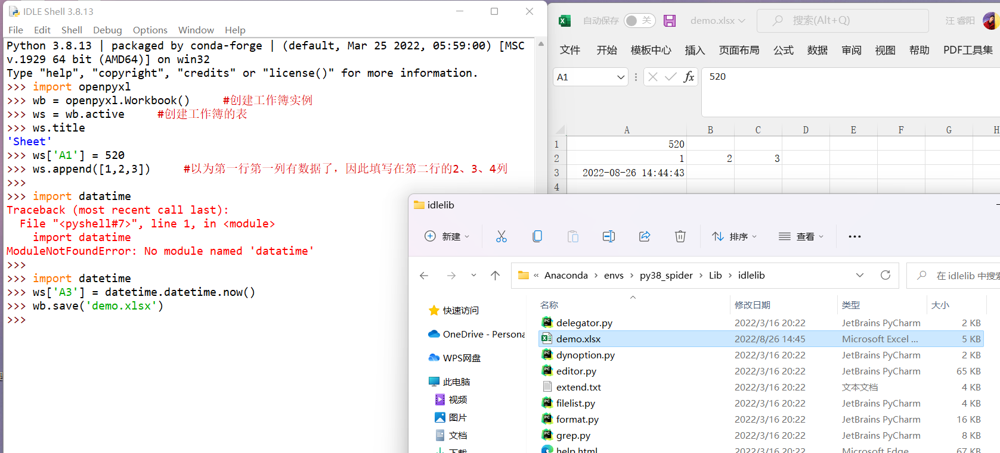

# 安装

## 安装openpyxl


## 打开环境的idle.bat

D:\Anaconda\envs\py38_spider\Lib\idlelib


# 创建表格




# 将txt转为excel

## 爬虫网页转为txt


```python
import requests
import bs4
import re


def open_url(url):
    # 使用代理
    # proxies = {"http": "127.0.0.1:1080", "https": "127.0.0.1:1080"}
    headers = {
        'user-agent': 'Mozilla/5.0 (Windows NT 10.0; WOW64) AppleWebKit/537.36 (KHTML, like Gecko) Chrome/57.0.2987.98 Safari/537.36'}

    # res = requests.get(url, headers=headers, proxies=proxies)
    res = requests.get(url, headers=headers)

    return res


def find_movies(res):
    soup = bs4.BeautifulSoup(res.text, 'html.parser')

    # 电影名
    movies = []
    targets = soup.find_all("div", class_="hd")
    for each in targets:
        movies.append(each.a.span.text)

    # 评分
    ranks = []
    targets = soup.find_all("span", class_="rating_num")
    for each in targets:
        ranks.append(' 评分：%s ' % each.text)

    # 资料
    messages = []
    targets = soup.find_all("div", class_="bd")
    for each in targets:
        try:
            messages.append(each.p.text.split('\n')[1].strip() + each.p.text.split('\n')[2].strip())
        except:
            continue

    result = []
    length = len(movies)
    for i in range(length):
        result.append(movies[i] + ranks[i] + messages[i] + '\n')

    return result


# 找出一共有多少个页面
def find_depth(res):
    soup = bs4.BeautifulSoup(res.text, 'html.parser')
    depth = soup.find('span', class_='next').previous_sibling.previous_sibling.text

    return int(depth)


def main():
    host = "https://movie.douban.com/top250"
    res = open_url(host)
    depth = find_depth(res)

    result = []
    for i in range(depth):
        url = host + '/?start=' + str(25 * i)
        res = open_url(url)
        result.extend(find_movies(res))

    with open("豆瓣TOP250电影.txt", "w", encoding="utf-8") as f:
        for each in result:
            f.write(each)


if __name__ == "__main__":
    main()
```

## txt转为excel


```python
import requests
import bs4
import re
import openpyxl
 
def open_url(url):
    # 使用代理
    # proxies = {"http": "127.0.0.1:1080", "https": "127.0.0.1:1080"}
    headers = {'user-agent': 'Mozilla/5.0 (Windows NT 10.0; WOW64) AppleWebKit/537.36 (KHTML, like Gecko) Chrome/57.0.2987.98 Safari/537.36'}
 
    # res = requests.get(url, headers=headers, proxies=proxies)
    res = requests.get(url, headers=headers)
 
    return res
 
def find_movies(res):
    soup = bs4.BeautifulSoup(res.text, 'html.parser')
 
    # 电影名
    movies = []
    targets = soup.find_all("div", class_="hd")
    for each in targets:
        movies.append(each.a.span.text)
 
    # 评分
    ranks = []
    targets = soup.find_all("span", class_="rating_num")
    for each in targets:
        ranks.append(each.text)
 
    # 资料
    messages = []
    targets = soup.find_all("div", class_="bd")
    for each in targets:
        try:
            messages.append(each.p.text.split('\n')[1].strip() + each.p.text.split('\n')[2].strip())
        except:
            continue
 
    result = []
    length = len(movies)
    for i in range(length):
        result.append([movies[i],ranks[i],messages[i]])
 
    return result


#保存为xlsx, import openpyxl
def save_to_excel(result):
    wb = openpyxl.Workbook()
    ws = wb.active

    ws['A1'] = '电影名称'
    ws['B1'] = '评分'
    ws['C1'] = '资料'

    for each in result:
        ws.append(each)     #each是一个列表元组，而不是字符串

    wb.save("豆瓣TOP250电影.xlsx")


# 找出一共有多少个页面
def find_depth(res):
    soup = bs4.BeautifulSoup(res.text, 'html.parser')
    depth = soup.find('span', class_='next').previous_sibling.previous_sibling.text
 
    return int(depth)
 
def main():
    host = "https://movie.douban.com/top250"
    res = open_url(host)
    depth = find_depth(res)
 
    result = []
    for i in range(depth):
        url = host + '/?start=' + str(25 * i)
        res = open_url(url)
        result.extend(find_movies(res))

    save_to_excel(result)

if __name__ == "__main__":
    main()
```


# 打开工作簿


# 处理工作表

## 获取名称


## 打开工作表


## 创建工作表


## 删除工作表

### 方法一


### 方法二


## 定位单元格


## 列数转换


## 切片


## 拷贝工作表


## 修改工作表标签颜色


## 调整行高和列宽


## 合并单元格

### 合并


### 拆分


## 冻结与解冻

### 冻结


### 解冻


