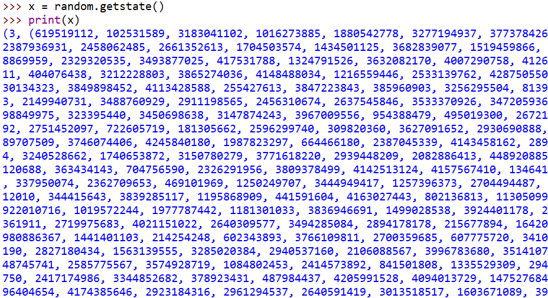
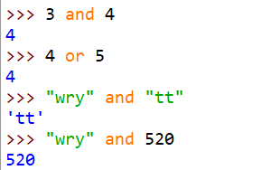
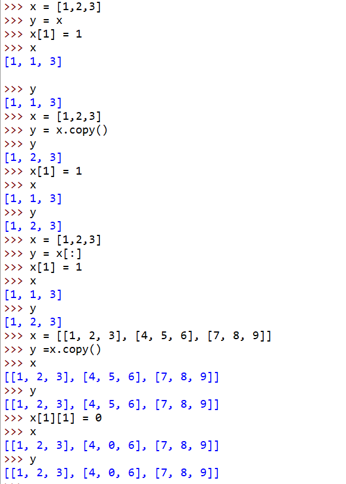
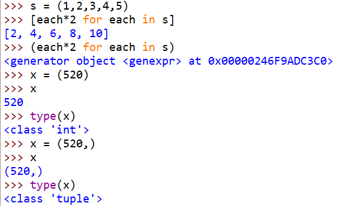
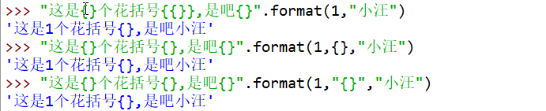
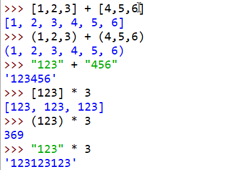
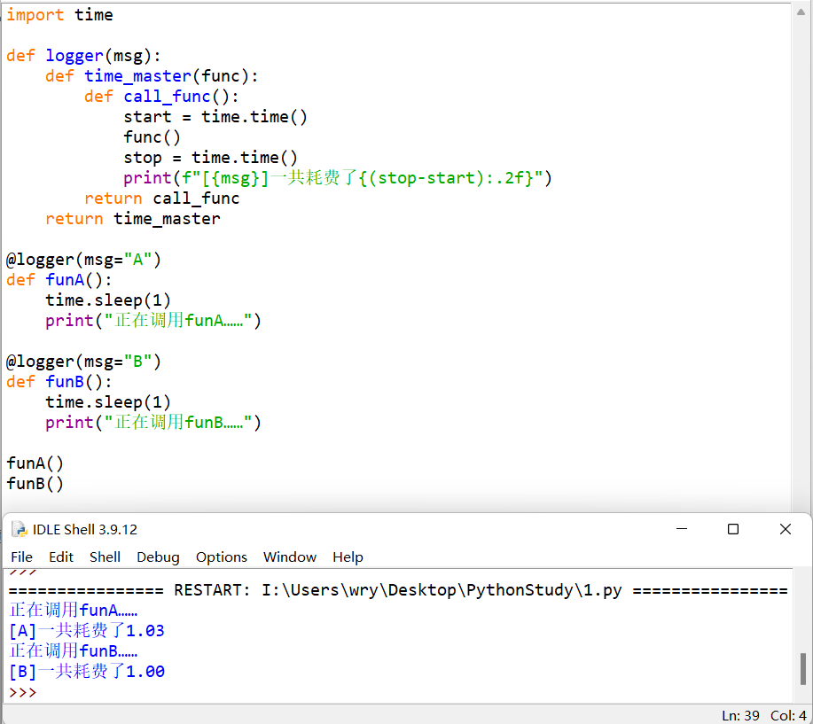

# 序

## 使用Anaconda打开IDLE

[anaconda如何打开IDLE](https://blog.csdn.net/a137365121/article/details/103398240)

## IDLE设置


# 学习

## 7.1

### game


### study1


>  x, y = y, x 调换值
>
> print(x,y) 能直接输入两个值，之间用空格隔开

### study2


> ""和''具有同等效力，都能使用在字符串上（''不局限于字符）
>
> ""和''要成双成对出现，且在""里可以直接有单个'，在''里可以直接有单个"
>
> 更推荐使用转义字符 \

### study3


> 1. \进行转义
> 2. 在字符串"..."之前加入r，表示全句原意输出
> 3. 在""或者''中\表示换行（在pycharm中可行），在""" """或者''' '''中可以随意换行

### study4


### study5（输入、输出）


> 1. input输入的是字符串
> 2. 如果字符串里的内容是阿拉伯数字，则可以用int强制转换（多位数也可以强制转换）

### game+


> 1. random.randint(1,100)，表示在1~99中随机选一个整数
> 2. python都是左闭右开

### study6（随机数）




> 对random伪随机数的攻击，可以用random.getstate()保存状态，在攻击前调用random.setstate()便可以生成和开始一样的随机数

### study7（运算）


> 1. python的浮点数运算有一定的误差（基于IEEE754标准），如果使用decimal（十进制）就不会有误差
> 2. 对于复数1+2j，使用real展示实部，使用imag展示虚部


> 1. //表示向下取整（更小）
> 2. divmod(a,b)生成的是**向下取整**和**余数**
> 3. abs表示求绝对值
> 4. complex(a,b)，其中a为复数实部，b为复数虚部
> 5. pow(a,b)和a**b等效
> 6. pow(a,b,c)和a**b%c等效

## 7.2

### study1（bool运算）


> 1. 对于字符串除了空字符串为false，其他的都是true（包括空格也是true）
> 2. 如果数值为0、0.0、0j这类都是false，其他的都是true

### study2（复杂运算）





> 1. python中逻辑运算符是：and, or, not，不能用&&, ||, !
> 2. 对于and/or两边如果为真实值：and的左边为true，则输出右边；or的左边为true，则输出左边；否则相反。
> 3. 优先级：**or < and < not**(先运算not)

### study3


> 分支结构用：if、**elif**、else

### study4


> **ctrl+j**换行
>
> **alt+p**可以重写上一句

### study5


> python中**没有 i++**


> while为false时跳出循环，如果是正常结束，则表示为false，则会继续while外的所有内容，包括else
>
> 如果为break结束，则表示依然为true，不会执行后面的else

### study6（循环while与for）


### study7（列表list[]）


> 1. 列表的切片很重要
> 2. append()在列表后面插入单个值
> 3. extend()在列表后面插入列表
> 4. insert(i,x)表示在下标为i的位置插入x值
> 5. remove(x)表示删除列表中**值为x的且下标最小**的元素
> 6. pop(i)表示删除并返回下标为i的元素
> 7. clear()表示清空列表
> 8. 尾部插入操作可以直接list[i:]= ,可以插入单个元素或者列表

### study8（列表）


> 1. index(x)表示返回列表中值为x的且下标最小的下标；
> 2. index(x,start,end)可以规定要找的起始下标和终点下标（一样是**左闭右开**）
> 3. copy()为浅拷贝，与nums[:]效果相同


> 在print中加入end=" " 可以设置以空格结束，默认为换行


> 若要建立多维列表，可以在外层用乘法建立，再在循环内用乘法建立。不能用连乘建立。第一种方法生成的子列表指针不同，第二种方法生成的子列表指针都相同




> 对多维列表使用copy库中：
>
> 1. copy.copy(x)是对x的浅拷贝
> 2. copy.deepcopy(x)是对x的深拷贝
>
> 对一维列表：
>
> 1. =是浅拷贝
> 2. copy和切片都是深拷贝


> 列表表达式


> 列表表达式进阶
>
> 1. `i for i in range(10)`，先for，再总体
> 2. `i for i in range(10) if i%2==0 `，先for，再if，再总体
> 3. `i for row in matrix for i in row`，先在matrix取row，再在row取i，再总体

## 7.3

### study1（元组()）


> 1. 元组只能查，不能增删改
> 2. 元组只有count()和index()两个函数
> 3. 可以有多维元组，查看时也可以用for嵌套



> 1. 元组可以用列表表达式转换为列表，但不能将一个元组直接变成另一个元组
> 2. 生成一个只有一个元素的元组（tuple），需要在值后面加一个 , 


> 1. 元组支持快速赋值，最后一个变量前如果有*则将后面的元素全都给它


> 1. python中序列类型都支持快速赋值
> 2. 将列表名放入元组中，则可以求改其里面内容

### study2（字符串相关函数）


## 7.7

### study1（字符串相关函数）


### study2


## 7.13

### study1（format赋值）





> 1. {1:>10}：1表示位置，>表示右对齐，10表示一共十个空
> 2. {1:%>10}：1表示位置，>表示右对齐，10表示一共十个空，空的位置填上%
> 3. {:010}：表示自动判别符号填充10个空，空填0
> 4. {:0=10}：表示自动判别符号填充10个空，空填0


> f字符串要求python>3.6版本

### study2

> **序列**分为**可变序列**和**不可变序列**
>
> 可变序列：列表
>
> 不可变序列：元组、字符串

#### 共性



#### 个性


#### is


#### in


#### del


## 7.18

### study1（字符串、列表、元组转换）


### study2


### study3（字典）


#### 增


#### 删


#### 改


#### 查


  

##                                8.16

### study1（集合）

 

### study2（交集、并集........）（集合（上））


### study3（哈希）（集合（下））


列表变成集合，效率往往会增大很多（因为可散列，空间换时间）


### study4（函数）


### study5


### study6（收集参数）


### study7（变量区域、嵌套函数）


> **gobal x**：将局部变量x改为已经定义或者没有定义的全局变量
>
> **nonlocal x**：使得内部函数可以修改外部函数的变量值

### study8（函数闭包）


> 👆为闭包，可以用它实现一个带记忆功能的函数（核心为nonlocal）

### study9（装饰器入门）

#### 简单调用


#### 优化（装饰器）


> 表示如果调用myfunc函数时即将myfunc的函数作为time_master的参数进行调用

#### 装饰器等效实现


```python
import time

def time_master(func):
    def call_func():
        print("开始运行程序...")
        start = time.time()
        func()
        stop = time.time()
        print("结束程序运行...")
        print(f"一共耗费{(stop-start):.2f}秒")
    return call_func

def myfunc():
    time.sleep(2)
    print("I love U")

myfunc = time_master(myfunc)

myfunc()
```


### study10（装饰器进阶）

#### 同时使用多个装饰器


``` python
def add(func):
    def inner():
        x = func()     #调用传入的函数
        print("add")
        return x+1
    return inner

def cube(func):
    def inner():
        x = func()
        print("cube")
        return x*x*x
    return inner

def square(func):
    def inner():
        x = func()
        print("square")
        return x*x
    return inner

@add
@cube
@square
def test():
    return 2

print(test())
```

#### 给装饰器传递参数



```python
import time

def logger(msg):
    def time_master(func):
        def call_func():
            start = time.time()
            func()
            stop = time.time()
            print(f"[{msg}]一共耗费了{(stop-start):.2f}")
        return call_func
    return time_master

@logger(msg="A")
def funA():
    time.sleep(1)
    print("正在调用funA……")

@logger(msg="B")
def funB():
    time.sleep(1)
    print("正在调用funB……")

funA()
funB()

```

#### 装饰器传参等效


```python
import time

def logger(msg):
    def time_master(func):
        def call_func():
            start = time.time()
            func()
            stop = time.time()
            print(f"[{msg}]一共耗费了{(stop-start):.2f}")
        return call_func
    return time_master

def funA():
    time.sleep(1)
    print("正在调用funA……")

def funB():
    time.sleep(1)
    print("正在调用funB……")

funA = logger(msg="A")(funA)
funB = logger(msg="B")(funB)
funA()
funB()
```


## 8.20

### study1（lambda表达式）

#### 用法

```python
name = lambda [list] : 表达式
#必须使用 lambda 关键字；[list] 作为可选参数，等同于定义函数是指定的参数列表；value 为该表达式的名称

#等效于
def name(list):
    return 表达式
name(list)
```

#### 入门


#### 进阶


### study2（生成器）

> 既不用全局变量污染命名空间，也无需使用闭包增加代码难度
>
> 将函数中return改为yield，但不具备退出能力

#### 入门


> 生成器每调用一次生成一个数据，并且记住当前状态（列表等是容器，早已存好所有的数据和状态）


> 生成器支持next函数，不支持使用[]下标定位

#### 生成器实现斐波那契数列


#### 生成器表达式


### study3（递归）

#### 入门


#### 求正整数的阶乘

##### 迭代


##### 递归


#### 斐波那契数列


> 递归导致效率问题

#### 汉诺塔


```python
def hanoi(n,x,y,z):
    if n==1:    #只有一层了
        print(x,'-->',z)
    else:
        hanoi(n-1,x,z,y)     #将x上n个移到z的问题 转为 将x上面n-1个移到y的问题
        print(x,'-->',z)     #将x中剩下的唯一一个（也是最大的），移到z
        hanoi(n-1,y,x,z)     #将y上的n-1（全部）移到z中，也就是以y为起点，移动到z

n = int(input('请输入汉诺塔的层数:'))
hanoi(n,'A','B','C')
```


### study4（开发文档和注释）

#### 开发文档


#### 类型注释


> 给人看的，不是给机器看的


> mypy 是 Python 中的静态类型检查器，可以百度搜索安装使用

#### 内省


### study5（高阶函数）


### study6（文件）

> 文件位置为idle.bat文件所在位置（D:\Anaconda\Lib\idlelib）


> w打开文件，啥也不干直接close()，会清空整个文档


> 验证w打开文件一定会清空文件内容


## 8.21

### study1（pathlib）

> from pathlib import Path     #从pathlib中导入Path，后面就不用加上模块名pathlib

####  查找


#### 增加


#### ！修改（rename和replace）

> rename修改后会将文件转到当前根目录下

#### 删除


#### 高级功能glob()搜索

> glob()为高级查找功能
>
> **p.glob('*.txt')**：查找当前路径所有txt文件
>
> **p.glob('\*/\*.txt')**：查找当前路径的所有下级路径的所有txt文件
>
> **p.glob('\*\*/\*.txt')**：查找当前路径的所有子路径（包括孙子、重孙子等等）的所有txt文件（）


### study2(上下文管理器)

#### with语句

> 优势：如果中间的操作语句有错误，文件是不会创建的，对资源的利用更好。（原始写法会按顺序执行，先创建文件，但是如果中间语句出错，最后会有一个空的文件）


##### 原始写法


#### pickle语句

> 优势：永久存储python对象（序列化，转为二进制字节流）

##### 写入


```python
import pickle

x, y, z = 1, 2, 3
s = "wry"
l = ["帅气小汪",818,11.07]
d = {"one":1, "two":2}

with open("data.pkl","wb") as f:     #使用wb（二进制写入）
    pickle.dump(x,f)
    pickle.dump(y,f)
    pickle.dump(z,f)
    pickle.dump(s,f)
    pickle.dump(l,f)
    pickle.dump(d,f)
```

##### 写入优化


```python
import pickle

x, y, z = 1, 2, 3
s = "wry"
l = ["帅气小汪",818,11.07]
d = {"one":1, "two":2}

with open("data.pkl","wb") as f:     #使用wb（二进制写入）
    pickle.dump((x,y,z,s,l,d),f)    #用元组打包
```

##### 读取


```python
import pickle

with open("data.pkl","rb") as f:
    x = pickle.load(f)
    y = pickle.load(f)
    z = pickle.load(f)
    s = pickle.load(f)
    l = pickle.load(f)
    d = pickle.load(f)

print(x, y, z, s, l, d, sep="\n")
```

##### 读取优化

> sep="\n"：表示换行分割


```python
import pickle

with open("data.pkl","rb") as f:
    x, y, z, s, l, d = pickle.load(f)

print(x, y, z, s, l, d, sep="\n")
```


### study3（异常）

#### 基础语法（被动触发异常）

##### try-except


##### try-except-else


##### try-except-else-finally


##### try-except-finally


##### try-finally


> 设置一个死循环，在两次ctrl+c强制退出后仍然会先执行finally中的语句

#### 异常嵌套


#### 主动触发异常

##### raise语句（自爆）


##### assert语句（用于代码调试）

> 只会出现AssertionError异常


#### 利用异常实现goto

> python官方不支持goto语句


### study4（类和对象）

#### 创建类

> 方法中参数必须要有self，否则无法调用
>
> 


```python
class Turtle:     #一般创建类都是首字母大写
    head = 1
    eyes = 2
    legs = 4
    shell = True

    def crawl(self):
        print("正在使用crawl方法")
    def run(self):
        print("正在使用run方法")
    def bite(self):
        print("正在使用bite方法")
    def eat(self):
        print("正在使用eat方法")
    def sleep(self):
        print("正在使用sleep方法")
```


#### 封装


## 8.22

### study1

#### 继承


#### 覆盖


> isinstance()判断对象是否属于某个类


> issubclass()判断一个类是否为另一个类的子类


#### 多重继承（一个子类继承多个父类）

> 按照从左到右的顺序调用属性（如果A中有x和hello()，则调用A的；但是A中没有y，则继续调用B的）


#### 组合


#### 继承中的self作用


#### 最小的类用作字典

> 可以代替字典进行存储


### study2

#### _\_init\_\_()构造函数


#### super()重写

> 按照mro顺序调用


### study3（mix-in组合）（超级重点！！！！！！！！！）


```python
class Displayer:
    def display(self,message):
        print(message)

class LoggerMixin:
    def log(self,message,filename="logfile.txt"):
        with open(filename,"a") as f:
            f.write(message)

    def display(self,message):
        super().display(message)
        self.log(message)

class MySubClass(LoggerMixin,Displayer):
    def log(self,message):
        super().log(message,filename="subclasslog.txt")

subclass = MySubClass()
subclass.display("This is a test.")
```

> **分析：**
>
> super()方法严重依赖mro顺序
>
> 
>
> 在`subclass.display("This is a test.")`中，发现MySubClass类中没有display方法，则调用LoggerMixin类，发现其有display方法，则进入其display()方法。
>
> 在LoggerMixin类中的display()方法中，message="This is a test."， `super().display(message)`先调用Display类，发现其有display方法，则进入其display()方法。
>
> 在Displayer类中的display()方法中，print了message，即This is a test.。
>
> 回到LoggerMixin类中的display()方法，继续执行` self.log(message)`，这里的self虽然在LoggerMixin类中，但是因为绑定的是subclass变量，而subclass的类型为MySubClass，因此调用的是MySubClass类的log()方法。
>
> 在MySubClass类的log()中，message仍然是"This is a test."，继续调用super()，即LoggerMixin类的log()方法，并传入message="This is a test."和filename="subclasslog.txt"。
>
> 在LoggerMixin类中的log()方法中，message="This is a test."，filename="subclasslog.txt"，打开方式a表示在文件末尾写入数据，即在subclasslog.txt后面写入This is a test.
>
> 结束


## 8.24

### study1

#### 多态

#### 重写（实现类继承的多态）


#### 实现多态接口


#### 鸭子类型


### study2

#### 私有变量

> 私有变量定义时，在变量名前加**__**
>
> 单个下划线开头的变量通常是仅供内部使用的变量，不要随意访问


> 名字改编是发生在实例化对象的时候


#### 私有方法


#### 类与字典（slots）

> 类中对象可以灵活添加，但是字典占用极大空间


> 利用**\_\_slots\_\_**定义对象，则不可以在后续添加对象，减少了灵活性，但极大地节省空间和提高稳定性


> 继承自父类的**\_\_slots\_\_**属性在子类中是不会生效的


### study3（魔术方法）

#### \__new__（实例化对象调用的第一个方法）


#### \__del__方法


> 利用del可以将对象重生，即在对象销毁之前，将self送出去，达到重生的目的
>
> 方法1：利用del函数中设置全局变量global保存self（不推荐，用全局变量会污染命名空间）
>
> 方法2：闭包（代码）（**nonlocal x**：使得内部函数可以修改外部函数的变量值）


#### python的魔术方法大全

| **魔法方法**                                        | **含义**                                                     |
| --------------------------------------------------- | ------------------------------------------------------------ |
| **基本的魔法方法**                                  |                                                              |
| **\__new__(cls[, ...])**                            | 1. \__new__ 是在一个对象实例化的时候所调用的第一个方法       |
| **\__init__(self[, ...])**                          | 构造器，当一个实例被创建的时候调用的初始化方法               |
| **\__del__(self)**                                  | 析构器，当一个实例被销毁的时候调用的方法                     |
| **\__call__(self[, args...])**                      | 允许一个类的实例像函数一样被调用：x(a, b) 调用 x.__call__(a, b) |
| **\__len__(self)**                                  | 定义当被 len() 调用时的行为                                  |
| **\__repr__(self)**                                 | 定义当被 repr() 调用时的行为                                 |
| **\__str__(self)**                                  | 定义当被 str() 调用时的行为                                  |
| **\__bytes__(self)**                                | 定义当被 bytes() 调用时的行为                                |
| **\__hash__(self)**                                 | 定义当被 hash() 调用时的行为                                 |
| **\__bool__(self)**                                 | 定义当被 bool() 调用时的行为，应该返回 True 或 False         |
| **\__format__(self, format_spec)**                  | 定义当被 format() 调用时的行为                               |
| **有关属性**                                        |                                                              |
| **\__getattr__(self, name)**                        | 定义当用户试图获取一个不存在的属性时的行为                   |
| **\__getattribute__(self, name)**                   | 定义当该类的属性被访问时的行为                               |
| **\__setattr__(self, name, value)**                 | 定义当一个属性被设置时的行为                                 |
| **\__delattr__(self, name)**                        | 定义当一个属性被删除时的行为                                 |
| **\__dir__(self)**                                  | 定义当 dir() 被调用时的行为                                  |
| **\__get__(self, instance, owner)**                 | 定义当描述符的值被取得时的行为                               |
| **\__set__(self, instance, value)**                 | 定义当描述符的值被改变时的行为                               |
| **\__delete__(self, instance)**                     | 定义当描述符的值被删除时的行为                               |
| **比较操作符**                                      |                                                              |
| **\__lt__(self, other)**                            | 定义小于号的行为：x < y 调用 x.__lt__(y)                     |
| **\__le__(self, other)**                            | 定义小于等于号的行为：x <= y 调用 x.__le__(y)                |
| **\__eq__(self, other)**                            | 定义等于号的行为：x == y 调用 x.__eq__(y)                    |
| **\__ne__(self, other)**                            | 定义不等号的行为：x != y 调用 x.__ne__(y)                    |
| **\__gt__(self, other)**                            | 定义大于号的行为：x > y 调用 x.\__gt__(y)                    |
| **\__ge__(self, other)**                            | 定义大于等于号的行为：x >= y 调用 x.\__ge__(y)               |
| **算数运算符**                                      |                                                              |
| **\__add__(self, other)**                           | 定义加法的行为：+                                            |
| **\__sub__(self, other)**                           | 定义减法的行为：-                                            |
| **\__mul__(self, other)**                           | 定义乘法的行为：*                                            |
| **\__truediv__(self, other)**                       | 定义真除法的行为：/                                          |
| **\__floordiv__(self, other)**                      | 定义整数除法的行为：//                                       |
| **\__mod__(self, other)**                           | 定义取模算法的行为：%                                        |
| **\__divmod__(self, other)**                        | 定义当被 divmod() 调用时的行为                               |
| **\__pow__(self, other[, modulo])**                 | 定义当被 power() 调用或 ** 运算时的行为                      |
| **\__lshift__(self, other)**                        | 定义按位左移位的行为：<<                                     |
| **\__rshift__(self, other)**                        | 定义按位右移位的行为：>>                                     |
| **\__and__(self, other)**                           | 定义按位与操作的行为：&                                      |
| **\__xor__(self, other)**                           | 定义按位异或操作的行为：^                                    |
| **\__or__(self, other)**                            | 定义按位或操作的行为：\|                                     |
| **反运算**                                          |                                                              |
| **\__radd__(self, other)**                          | （与上方相同，当左操作数不支持相应的操作时被调用）           |
| **\__rsub__(self, other)**                          | （与上方相同，当左操作数不支持相应的操作时被调用）           |
| **\__rmul__(self, other)**                          | （与上方相同，当左操作数不支持相应的操作时被调用）           |
| **\__rtruediv__(self, other)**                      | （与上方相同，当左操作数不支持相应的操作时被调用）           |
| **\__rfloordiv__(self, other)**                     | （与上方相同，当左操作数不支持相应的操作时被调用）           |
| **\__rmod__(self, other)**                          | （与上方相同，当左操作数不支持相应的操作时被调用）           |
| **\__rdivmod__(self, other)**                       | （与上方相同，当左操作数不支持相应的操作时被调用）           |
| **\__rpow__(self, other)**                          | （与上方相同，当左操作数不支持相应的操作时被调用）           |
| **\__rlshift__(self, other)**                       | （与上方相同，当左操作数不支持相应的操作时被调用）           |
| **\__rrshift__(self, other)**                       | （与上方相同，当左操作数不支持相应的操作时被调用）           |
| **\__rand__(self, other)**                          | （与上方相同，当左操作数不支持相应的操作时被调用）           |
| **\__rxor__(self, other)**                          | （与上方相同，当左操作数不支持相应的操作时被调用）           |
| **\__ror__(self, other)**                           | （与上方相同，当左操作数不支持相应的操作时被调用）           |
| **增量赋值运算**                                    |                                                              |
| **\__iadd__(self, other)**                          | 定义赋值加法的行为：+=                                       |
| **\__isub__(self, other)**                          | 定义赋值减法的行为：-=                                       |
| **\__imul__(self, other)**                          | 定义赋值乘法的行为：*=                                       |
| **\__itruediv__(self, other)**                      | 定义赋值真除法的行为：/=                                     |
| **\__ifloordiv__(self, other)**                     | 定义赋值整数除法的行为：//=                                  |
| **\__imod__(self, other)**                          | 定义赋值取模算法的行为：%=                                   |
| **\__ipow__(self, other[, modulo])**                | 定义赋值幂运算的行为：**=                                    |
| **\__ilshift__(self, other)**                       | 定义赋值按位左移位的行为：<<=                                |
| **\__irshift__(self, other)**                       | 定义赋值按位右移位的行为：>>=                                |
| **\__iand__(self, other)**                          | 定义赋值按位与操作的行为：&=                                 |
| **\__ixor__(self, other)**                          | 定义赋值按位异或操作的行为：^=                               |
| **\__ior__(self, other)**                           | 定义赋值按位或操作的行为：\|=                                |
| **一元操作符**                                      |                                                              |
| **\__pos__(self)**                                  | 定义正号的行为：+x                                           |
| **\__neg__(self)**                                  | 定义负号的行为：-x                                           |
| **\__abs__(self)**                                  | 定义当被 abs() 调用时的行为                                  |
| **\__invert__(self)**                               | 定义按位求反的行为：~x                                       |
| **类型转换**                                        |                                                              |
| **\__complex__(self)**                              | 定义当被 complex() 调用时的行为（需要返回恰当的值）          |
| **\__int__(self)**                                  | 定义当被 int() 调用时的行为（需要返回恰当的值）              |
| **\__float__(self)**                                | 定义当被 float() 调用时的行为（需要返回恰当的值）            |
| **\__round__(self[, n])**                           | 定义当被 round() 调用时的行为（需要返回恰当的值）            |
| **\__index__(self)**                                | 1. 当对象是被应用在切片表达式中时，实现整形强制转换 2. 如果你定义了一个可能在切片时用到的定制的数值型,你应该定义 \_\_index\__ 3. 如果 \_\_index__ 被定义，则 \_\_int__ 也需要被定义，且返回相同的值 |
|                                                     | 上下文管理（with 语句）                                      |
| **\__enter__(self)**                                | 1. 定义当使用 with 语句时的初始化行为 2. \__enter__ 的返回值被 with 语句的目标或者 as 后的名字绑定 |
| **\__exit__(self, exc_type, exc_value, traceback)** | 1. 定义当一个代码块被执行或者终止后上下文管理器应该做什么 2. 一般被用来处理异常，清除工作或者做一些代码块执行完毕之后的日常工作 |
| **容器类型**                                        |                                                              |
| **\__len__(self)**                                  | 定义当被 len() 调用时的行为（返回容器中元素的个数）          |
| **\__getitem__(self, key)**                         | 定义获取容器中指定元素的行为，相当于 self[key]               |
| **\__setitem__(self, key, value)**                  | 定义设置容器中指定元素的行为，相当于 self[key] = value       |
| **\__delitem__(self, key)**                         | 定义删除容器中指定元素的行为，相当于 del self[key]           |
| **\__iter__(self)**                                 | 定义当迭代容器中的元素的行为                                 |
| **\__reversed__(self)**                             | 定义当被 reversed() 调用时的行为                             |
| **\__contains__(self, item)**                       | 定义当使用成员测试运算符（in 或 not in）时的行为             |

