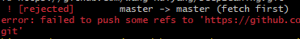

# 安装记录

**戳我点击🖱️[InstallMemo（AutoDL+VM+Local）](https://github.com/Wang-Ruiyang/DeepLeaning/tree/master/Install)**


# GitHub上传文件

| **第一次操作**                       | **更新操作**                      |
| ------------------------------------ | --------------------------------- |
| 1. 新建文件夹                        |                                   |
| 2. `git init`                        | 1. `git init`                     |
| 3. 将要上传的文件放入新文件夹中      |                                   |
| 4. `git add .`                       | 2. `git add .`                    |
| 5. `git commit -m "你的提交信息"`    | 3. `git commit -m "你的提交信息"` |
| 6. `git remote add origin + httpurl` |                                   |
| 7. `git push -u origin master`       | 4. `git push`                     |

## error



```sh
git pull --rebase origin master
git push
```


# **学习记录**

**[python基本语法学习（完）🖱️](https://github.com/Wang-Ruiyang/DeepLeaning/tree/master/PythonStudy)**

**[python表格处理（更新）🖱️](https://github.com/Wang-Ruiyang/DeepLeaning/tree/master/PythonExcel)**

**[python数据处理（更新）🖱️](https://github.com/Wang-Ruiyang/DeepLeaning/tree/master/PythonData)**

**[爬虫（更新）🖱️](https://github.com/Wang-Ruiyang/DeepLeaning/tree/master/Spider)**
