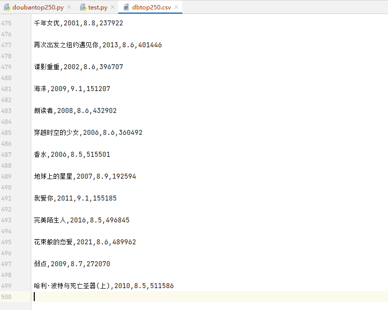

# 环境配置

> python3.8 + pycharm
>


# 爬虫学习

## Python自带库（不推荐）

### 打开网页

`from urllib.request import urlopen`：打开网址

```py
from urllib.request import urlopen

url = "http：//www.baidu.com"
resp = urlopen(url)    #打开网址，返回数据

resd = resp.read()    #读取数据

print(resd)   #会输出字节，我们需要将字节还原成字符串
```


需要转码为utf-8：

```py
from urllib.request import urlopen

url = "http：//www.baidu.com"
resp = urlopen(url)    #打开网址，返回数据
print(resp.read().decode("utf-8"))   #会输出字节，我们需要将字节还原成字符串
```


保存到文件：

> 得到网页的源代码
>
> `encoding="utf-8"`：windows默认gbk，不加这个会乱码

```python
from urllib.request import urlopen

url = "http：//www.baidu.com"
resp = urlopen(url)    #打开网址，返回数据

with open("mybaidu.html",mode="w", encoding="utf-8") as f：
    f.write(resp.read().decode("utf-8"))
```


## HTTP协议

请求头中最常⻅的⼀些重要内容（爬⾍需要）：（GET搜索、POST修改）
1. User-Agent ： 请求载体的身份标识（⽤啥发送的请求）（伪装成非机器）
2. Referer： 防盗链（这次请求是从哪个⻚⾯来的? 反爬会⽤到）
3. cookie：本地字符串数据信息（⽤户登录信息, 反爬的token）

响应头中⼀些重要的内容：

1. cookie： 本地字符串数据信息（⽤户登录信息, 反爬的token）

2. 各种神奇的莫名其妙的字符串（这个需要经验了, ⼀般都是token字样, 防⽌各种攻击和反爬）


## Requests模块

### 安装

`pip install requests`

### 第一个测试：百度搜索

```py
import requests

query = input("输入你要查找的信息：")

url = f'http://www.baidu.com/s?wd={query}'

#伪装成非机器
dic = {
    "User-Agernt": "Mozilla/5.0 (Windows NT 10.0; Win64; x64) AppleWebKit/537.36 (KHTML, like Gecko) Chrome/105.0.0.0 Safari/537.36 Edg/105.0.1343.27"
}

resp = requests.get(url,headers=dic)   #处理一个小小的反爬机制

print(resp)
print(resp.text)
```

### 第二个测试：百度翻译


```python
import requests

url = 'https://fanyi.baidu.com/sug'

s = input("输入你要翻译的英文：")
#发送的数据必须放在字典中，通过data参数进行传递
ever = {
    "kw": s
}

#发送post请求
resp = requests.post(url,data=ever)
print(resp.json())     #将服务器返回的内容直接处理成json => dict字典
```


### 第三个测试：豆瓣分类爬取

> `resp.close()`：防止访问次数过多报错

```py
import requests

# url = "https://movie.douban.com/j/chart/top_list?type=11&interval_id=100%3A90&action=&start=0&limit=20"
url = "https://movie.douban.com/j/chart/top_list"

param = {
    "type": "11",
    "interval_id": "100:90",
    "action": "",
    "start": "0",    #翻页时会变
    "limit": "20"
}

header = {
    "User-Agent": "Mozilla/5.0 (Windows NT 10.0; Win64; x64) AppleWebKit/537.36 (KHTML, like Gecko) Chrome/105.0.0.0 Safari/537.36 Edg/105.0.1343.27"
}

resp = requests.get(url=url,params=param,headers=header)

# print(resp.request.url)    #https://movie.douban.com/j/chart/top_list?type=11&interval_id=100%3A90&action=&start=0&limit=20
# print(resp.request.headers)    #{'User-Agent': 'python-requests/2.28.1', 'Accept-Encoding': 'gzip, deflate, br', 'Accept': '*/*', 'Connection': 'keep-alive'}
print(resp.text)
resp.close()
```


## 数据解析

### re解析（最快）

#### re = 正则表达式

| 元字符: 具有固定含义的特殊符号 常⽤元字符：                  |
| ------------------------------------------------------------ |
| . 匹配除换⾏符以外的任意字符                                 |
| \w 匹配字⺟或数字或下划线                                    |
| \s 匹配任意的空⽩符                                          |
| \d 匹配数字                                                  |
| \n 匹配⼀个换⾏符                                            |
| \t 匹配⼀个制表符                                            |
|                                                              |
| ^ 匹配字符串的开始                                           |
| $ 匹配字符串的结尾                                           |
|                                                              |
| \W 匹配⾮字⺟或数字或下划线                                  |
| \D 匹配⾮数字                                                |
| \S 匹配⾮空⽩符                                              |
|                                                              |
| a\|b 匹配字符a或字符b                                        |
| () 匹配括号内的表达式，也表示⼀个组                          |
| [...] 匹配字符组中的字符     [a-zA-Z0-9]：表示匹配a-z、A-Z、0-9 |
| \[^...] 匹配**除了**字符组中字符的所有字符     **^**表示**非**的意思 |

| 量词：控制前⾯的**元字符**出现的次数： |
| -------------------------------------- |
| \* 重复零次或更多次                    |
| \+ 重复⼀次或更多次                    |
| ? 重复零次或⼀次                       |
| **{n} 重复n次**                        |
| {n,} 重复n次或更多次                   |
| {n,m} 重复n到m次                       |

| 贪婪匹配和惰性匹配：                                         |
| ------------------------------------------------------------ |
| .* 贪婪匹配                                                  |
| .*? 惰性匹配（选短的匹配，也就是\*尽可能少的成功匹配）       |
| .*?x  表示从头开始匹配，到第一个x停，再从此x之后重新匹配，以此类推 |

#### 实例

```py
import re
```

`findall()`：匹配字符串中所有符合正则的内容，返回的是列表

```py
lst = re.findall(r"\d+","我的电话号码时：10000，我女朋友的电话是：10002")
print(lst)
```

⭐`finditer()`：匹配字符串中所有符合正则的内容，返回的是迭代器（比列表速度快很多），需要用`.group()`

> 迭代器只要循环迭代一次就会消失

```py
it = re.finditer(r"\d+","我的电话号码时：10000，我女朋友的电话是：10002")

print(it)

for i in it:
    print(i)
    print(i.group())
```


`search()`找到一个结果就返回，返回的结果是match对象，拿数据需要.group()

```py
s = re.search(r"\d+","我的电话号码时：10000，我女朋友的电话是：10002")

print(s.group())
```

`match()`是从头开始匹配，如果第一个字符不满足，直接返回错误

```py
s = re.match(r"\d+","我的电话号码时：10000，我女朋友的电话是：10002")

print(s.group())
```

#### 正则预加载

`compile()`函数进行预加载，能提高一点点效率，能使得正则表达式被反复调用

```py
import re

obj = re.compile(r"\d+")    #匹配连续数字

ret = obj.finditer("我的电话号码时：10000，我女朋友的电话是：10002")

for it in ret:
    print(it.group())

#再次调用
ret = obj.findall("你还欠我10000000元！")
print(ret)
```


#### 提取正则中的内容

匹配html内容

```py
import re

s = """
<div class='jay'><span id='1'>联通</span></div>
<div class='jj'><span id='2'>移动</span></div>
<div class='jolin'><span id='3'>电信</span></div>
<div class='sylar'><span id='4'>广电</span></div>
<div class='tory'><span id='5'>铁通</span></div>
"""

obj = re.compile(r"<div class='.*?'><span id='\d+'>.*?</span></div>", re.S)     #re.S：让.能匹配换行符

result = obj.finditer(s)

for it in result:
    print(it.group())
```


改进：从html中进行提取：

`(?P<变量名>正则表达式)`

```py
import re

s = """
<div class='jay'><span id='1'>联通</span></div>
<div class='jj'><span id='2'>移动</span></div>
<div class='jolin'><span id='3'>电信</span></div>
<div class='sylar'><span id='4'>广电</span></div>
<div class='tory'><span id='5'>铁通</span></div>
"""

#obj = re.compile(r"<div class='.*?'><span id='\d+'>.*?</span></div>", re.S)     #re.S：让.能匹配换行符
obj = re.compile(r"<div class='.*?'><span id='\d+'>(?P<name>.*?)</span></div>", re.S)    #(?P<name>.*?)表示将.*?匹配的内容传入name中

result = obj.finditer(s)

for it in result:
    print(it.group("name"))
```


改进：多个变量：

```py
import re

s = """
<div class='jay'><span id='1'>联通</span></div>
<div class='jj'><span id='2'>移动</span></div>
<div class='jolin'><span id='3'>电信</span></div>
<div class='sylar'><span id='4'>广电</span></div>
<div class='tory'><span id='5'>铁通</span></div>
"""

obj = re.compile(r"<div class='.*?'><span id='(?P<id>\d+)'>(?P<name>.*?)</span></div>", re.S)

result = obj.finditer(s)

for it in result:
    print(it.group("id"))
    print(it.group("name"))
```


#### 例：获取豆瓣电影TOP250

##### Step1：获取页面源代码

前提是页面内容都在源代码中

```py
import requests

url = "https://movie.douban.com/top250"
header = {
    "User-Agent": "Mozilla/5.0 (Windows NT 10.0; Win64; x64) AppleWebKit/537.36 (KHTML, like Gecko) Chrome/105.0.0.0 Safari/537.36 Edg/105.0.1343.27"
}

resp = requests.get(url, headers=header)
page_content = resp.text

print(page_content)
```


##### Step2：利用正则表达式提取信息


```python
import requests
import re

url = "https://movie.douban.com/top250"
header = {
    "User-Agent": "Mozilla/5.0 (Windows NT 10.0; Win64; x64) AppleWebKit/537.36 (KHTML, like Gecko) Chrome/105.0.0.0 Safari/537.36 Edg/105.0.1343.27"
}

resp = requests.get(url, headers=header)
page_content = resp.text

obj = re.compile(r'<li>.*?<div class="item">.*?<span class="title">(?P<name>.*?)'
                 r'</span>.*?<p class="">.*?<br>(?P<year>.*?)&nbsp.*?'
                 r'<span class="rating_num" property="v:average">(?P<score>.*?)</span>.*?'
                 r'<span>(?P<num>.*?)人评价</span>',re.S)

result = obj.finditer(page_content)
for it in result:
    print(it.group("name"))
    print(it.group("year").strip())     #.strip()消除空白
    print(it.group("score"))
    print(it.group("num"))    #评价人数
```


##### Step3：将爬取结果存在csv中

`import csv`：数据以逗号分隔，**适合pandas进行数据分析**

```py
import requests
import re
import csv

url = "https://movie.douban.com/top250"
header = {
    "User-Agent": "Mozilla/5.0 (Windows NT 10.0; Win64; x64) AppleWebKit/537.36 (KHTML, like Gecko) Chrome/105.0.0.0 Safari/537.36 Edg/105.0.1343.27"
}

#爬取网页源代码
resp = requests.get(url, headers=header)
page_content = resp.text

#写正则表达式模板
obj = re.compile(r'<li>.*?<div class="item">.*?<span class="title">(?P<name>.*?)'
                 r'</span>.*?<p class="">.*?<br>(?P<year>.*?)&nbsp.*?'
                 r'<span class="rating_num" property="v:average">(?P<score>.*?)</span>.*?'
                 r'<span>(?P<num>.*?)人评价</span>',re.S)

#调用正则表达式模板
result = obj.finditer(page_content)

#向文件写入数据（一页25个数据）
f = open("dbtop250.csv",mode="w",encoding="utf-8")     #encoding="utf-8"必须要加，否则会乱码 
csvwriter = csv.writer(f)
for it in result:
    dic = it.groupdict()    #将数据存成字典的格式
    dic["year"] = dic["year"].strip()
    csvwriter.writerow(dic.values())      #将字典的数据写入csv的每一行
    
#关闭文件
f.close()

print("over!")
```


##### Step4：实现翻页（完）

> 每一个start都+25，
>
> while形式：
>
> ```python
> i = 0
> while i<250:
>     i += 25
> ```
>
> for形式：
>
> ```py
> for i in range(0,250,25):
> ```

```python
import requests
import re
import csv

url = "https://movie.douban.com/top250"

header = {
    "User-Agent": "Mozilla/5.0 (Windows NT 10.0; Win64; x64) AppleWebKit/537.36 (KHTML, like Gecko) Chrome/105.0.0.0 Safari/537.36 Edg/105.0.1343.27"
}

param = {
    "start": "",
    "filter": ""
}

f = open("dbtop250.csv",mode="w",encoding="utf-8")
csvwriter = csv.writer(f)

#for i in range(0,250,25):
i = 0
while i<250:
    param["start"] = str(i)
    resp = requests.get(url, headers=header, params=param)
    page_content = resp.text
    obj = re.compile(r'<li>.*?<div class="item">.*?<span class="title">(?P<name>.*?)'
                     r'</span>.*?<p class="">.*?<br>(?P<year>.*?)&nbsp.*?'
                     r'<span class="rating_num" property="v:average">(?P<score>.*?)</span>.*?'
                     r'<span>(?P<num>.*?)人评价</span>', re.S)
    result = obj.finditer(page_content)
    for it in result:
        dic = it.groupdict()  # 将数据存成字典的格式
        dic["year"] = dic["year"].strip()
        csvwriter.writerow(dic.values())  # 将字典的数据写入csv的每一行
    i += 25

f.close()
print("over!")
```



#### 例：电影天堂电影信息

获得若干电影的下载链接，必须要进入子页面

##### Step1：从主页面提出子页面链接，并从多个链接中提取并合并成子页面链接

```py
import re
import requests

base_url = "https://dy.dytt8.net/"
url = "https://dy.dytt8.net/index2.htm"

header = {
    "User-Agent": "Mozilla/5.0 (Windows NT 10.0; Win64; x64) AppleWebKit/537.36 (KHTML, like Gecko) Chrome/105.0.0.0 Safari/537.36 Edg/105.0.1343.27"
}

# resp.text为源代码
resp = requests.get(url, headers=header)   #如果有安全验证，则加上 verify=False 字段
resp.encoding = "gb2312"     #和网站定义编码一致

#正则表达式模板，提取电影链接（多个）
obj = re.compile(r"最新华语电视剧推荐.*?<ul>(?P<mvsul>.*?)</ul>",re.S)
#从很多链接等字符串中区分出链接
obj2 = re.compile(r"<a href='(?P<movieul>.*?)'>2022年内地电视剧.*?<br/>",re.S)

result = obj.finditer(resp.text)
child_url_list = []

for i in result:
    # print(i.group("mvsul"))
    result2 = obj2.finditer(i.group("mvsul"))
    for ii in result2:
        # print(ii.group("movieul"))
        child_href = base_url + ii.group("movieul")
        child_url_list.append(child_href)    #将子页面链接保存到列表
        # print(child_href)

print(child_url_list)
```


##### Step2：进入子页面链接，获取链接，存在列表中，将列表存在字典中

```py
import re
import requests

base_url = "https://dy.dytt8.net/"
url = "https://dy.dytt8.net/index2.htm"

header = {
    "User-Agent": "Mozilla/5.0 (Windows NT 10.0; Win64; x64) AppleWebKit/537.36 (KHTML, like Gecko) Chrome/105.0.0.0 Safari/537.36 Edg/105.0.1343.27"
}

# resp.text为源代码
resp = requests.get(url, headers=header)   #如果有安全验证，则加上 verify=False 字段
resp.encoding = "gb2312"     #和网站定义编码一致

#正则表达式模板，提取电影链接（多个）
obj = re.compile(r"最新华语电视剧推荐.*?<ul>(?P<mvsul>.*?)</ul>",re.S)
#从很多链接等字符串中区分出链接
obj2 = re.compile(r"<a href='(?P<movieul>.*?)'>2022年内地电视剧.*?<br/>",re.S)

result = obj.finditer(resp.text)
child_url_list = []

for i in result:
    # print(i.group("mvsul"))
    result2 = obj2.finditer(i.group("mvsul"))
    for ii in result2:
        # print(ii.group("movieul"))
        child_href = base_url + ii.group("movieul")
        child_url_list.append(child_href)    #将子页面链接保存到列表
        # print(child_href)

# print(child_url_list)

#遍历子页面链接列表，进入每一个链接，提取需要的内容
obj3 = re.compile(r"<title>2022年内地电视剧(?P<name>.*?)迅雷下载_电影天堂</title>.*?【下载地址】.*?</p>(?P<download_uls>.*?) <br>",re.S)
obj4 = re.compile(r'.*?<a href=(?P<downul>.*?)">ftp:.*?</table>',re.S)
ul_dir ={}

for href in child_url_list:
    resp2 = requests.get(href, headers=header)
    resp2.encoding = "gb2312"
    result3 = obj3.finditer(resp2.text)
    ul_list = []
    for us in result3:
        # print(u.group("download_ul"))
        result4 = obj4.finditer(us.group("download_uls"))
        for u in result4:
            ul_list.append(u.group("downul"))
        ul_dir[us.group("name")] = ul_list      #将列表放入字典中，key为剧名

print(ul_dir)
```


##### Step3：将结果存在csv中

```py
import re
import requests
import csv

base_url = "https://dy.dytt8.net/"
url = "https://dy.dytt8.net/index2.htm"

header = {
    "User-Agent": "Mozilla/5.0 (Windows NT 10.0; Win64; x64) AppleWebKit/537.36 (KHTML, like Gecko) Chrome/105.0.0.0 Safari/537.36 Edg/105.0.1343.27"
}

# resp.text为源代码
resp = requests.get(url, headers=header)   #如果有安全验证，则加上 verify=False 字段
resp.encoding = "gb2312"     #和网站定义编码一致

#正则表达式模板，提取电影链接（多个）
obj = re.compile(r"最新华语电视剧推荐.*?<ul>(?P<mvsul>.*?)</ul>",re.S)
#从很多链接等字符串中区分出链接
obj2 = re.compile(r"<a href='(?P<movieul>.*?)'>2022年内地电视剧.*?<br/>",re.S)

result = obj.finditer(resp.text)
child_url_list = []

for i in result:
    # print(i.group("mvsul"))
    result2 = obj2.finditer(i.group("mvsul"))
    for ii in result2:
        # print(ii.group("movieul"))
        child_href = base_url + ii.group("movieul")
        child_url_list.append(child_href)    #将子页面链接保存到列表
        # print(child_href)

# print(child_url_list)

#遍历子页面链接列表，进入每一个链接，提取需要的内容
obj3 = re.compile(r"<title>2022年内地电视剧(?P<name>.*?)迅雷下载_电影天堂</title>.*?【下载地址】.*?</p>(?P<download_uls>.*?) <br>",re.S)
obj4 = re.compile(r'.*?<a href=(?P<downul>.*?)">ftp:.*?</table>',re.S)
ul_dir ={}

f = open("moviedown.csv",mode="w",encoding="utf-8")
csvwriter = csv.writer(f)

for href in child_url_list:
    resp2 = requests.get(href, headers=header)
    resp2.encoding = "gb2312"
    result3 = obj3.finditer(resp2.text)
    ul_list = []
    for us in result3:
        # print(u.group("download_ul"))
        result4 = obj4.finditer(us.group("download_uls"))
        for u in result4:
            ul_list.append(u.group("downul"))
        ul_dir[us.group("name")] = ul_list      #将列表放入字典中，key为剧名

csvwriter.writerow(ul_dir.values())  # 将字典的数据写入csv的每一行

f.close()
```


### bs4解析（最简单，效率不高）

利用html标签和属性

#### 安装

`pip install bs4`

#### 加载

`import requests`
`from bs4 import BeautifulSoup`

#### 例：爬取软科排行榜


```python
import requests
from bs4 import BeautifulSoup
import csv

url = "https://www.shanghairanking.cn/rankings/bcur/202011"

header = {
    "user-agent": "Mozilla/5.0 (Windows NT 10.0; Win64; x64) AppleWebKit/537.36 (KHTML, like Gecko) Chrome/105.0.0.0 Safari/537.36 Edg/105.0.1343.27"
}

resp = requests.get(url,headers=header)
resp.encoding = "utf-8"

#解析数据，把页面源代码交给BeautifulSoup进行处理，生成bs对象
page = BeautifulSoup(resp.text, "html.parser")    #"html.parser"原来告诉解析器传入的是HTML，可以避免警告

#从bs对象中查找属性
# table = page.find("table", class_="rk-table")    #查找class="rk-table"的table标签，因为class是python关键字，所以bs可以在class后加一个_，以作区分
table = page.find("table",attrs={"class":"rk-table"})     #与上面的效果等同
# print(table)

#删掉表头
trs = table.find_all("tr")[1:]     #将每一个tr（行）提取出来，并作切片，删去第一行（表头）

#创建csv
f = open("keruan.csv",mode="w",encoding="utf-8")
csvwriter = csv.writer(f)

for tr in trs:
    tds = tr.find_all("td")
    num = tds[0].text.strip()
    name = tr.find("a",attrs={"class":"name-cn"}).text.strip()
    city = tds[2].text.strip()
    type = tds[3].text.strip()
    score = tds[4].text.strip()
    level = tds[5].text.strip()
    csvwriter.writerow([num, name, city, type, score, level])

f.close()
```


（暂时无法实现翻页功能）

#### 例：爬取[壁纸](https://www.toopic.cn/)

```py
import requests
from bs4 import BeautifulSoup
import time

url = "https://www.toopic.cn"

header = {
    "user-agent": "Mozilla/5.0 (Windows NT 10.0; Win64; x64) AppleWebKit/537.36 (KHTML, like Gecko) Chrome/105.0.0.0 Safari/537.36 Edg/105.0.1343.27"
}

#获取页面源代码
resp = requests.get(url, headers=header)
resp.encoding = "utf-8"
# print(resp.text)

#解析数据，把页面源代码交给BeautifulSoup进行处理，生成bs对象
main_page = BeautifulSoup(resp.text, "html.parser")    #"html.parser"原来告诉解析器传入的是HTML，可以避免警告

#提取图片子页面短链接
alist = main_page.find("ul",attrs={"class":"clearfix pic-list gallery"}).find_all("a",attrs={"class":"pic"})
# print(alist)

#合成子页面完整链接
child_urls = []
for a in alist:
     child_urls.append(url+a.get("href"))      #通过get()函数获取每个a标签中的href字段
# print(child_urls)

#生成图片链接
img_url = []
for childul in child_urls:
    resp2 = requests.get(childul, headers=header)
    resp2.encoding = "utf-8"
    child_page = BeautifulSoup(resp2.text,"html.parser")
    imglist = child_page.find("div",attrs={"class":"preview-pic"}).find_all("img")
    for i in imglist:
        img_url.append(url+i.get("src"))
# print(img_url)

#下载图片
for img in img_url:
    img_resp = requests.get(img)     #获取图片请求
    img_name  = img.split("/")[-1]    #拿到url最后一个/之后的内容
    with open("img/"+img_name,mode="wb") as f:    #能自动f.close()
        f.write(img_resp.content)     #将文件以字节的形式写入
    print(img_name+"-over!")
    time.sleep(1)    #休息1s，防止被系统干掉
```

> **核心知识：**
>
> 1. `resp.encoding = "utf-8"`
>
> 2. `main_page = BeautifulSoup(resp.text, "html.parser")`：解析数据，把页面源代码交给BeautifulSoup进行处理，生成bs对象，"html.parser"原来告诉解析器传入的是HTML，可以避免警告
>
> 3. 下载图片
>
>    ```python
>    #下载图片
>    for img in img_url:
>        img_resp = requests.get(img)     #获取图片请求
>        img_name  = img.split("/")[-1]    #拿到url最后一个/之后的内容
>        with open("img/"+img_name,mode="wb") as f:    #能自动f.close()
>            f.write(img_resp.content)     #将文件以字节的形式写入
>    ```
>
> 4. 延迟设置：`import time`，`time.sleep(1)`（单位是秒）
>
> 5. Pycharm优化：如果爬取过多，pycharm制作的索引就会很多，导致很卡，需要对文件夹进行排除索引设置。
>
>    


### xpath解析（流行、舒服）

类似于文件夹路径（节点之间的关系），也可以利用属性查找

#### 安装

`pip install lxml`

#### 加载

`from lxml import etree`

#### 练习1

```py
from lxml import etree

xml = """
<nitf>
    <head>
        <title>Colombia Earthquake</title>
    </head>
    <body>
        <headline>
            <hl1>143 Dead in Colombia Earthquake</hl1>
        </headline>
        <byline>
            <bytag>By Jared Kotler, Associated Press Writer</bytag>
        </byline>
        <date>Monday January 25 2000</date>
        <dateline>
            <location>Bogota, Colombia</location>
            <date>Monday January 25 1999 7:28 ET</date>
        </dateline>
        <div>
            <date>Monday January 25 3000</date>
        </div>
    </body>
</nitf>
"""

tree = etree.XML(xml)
# result = tree.xpath("/nitf/head/title/text()")
# result = tree.xpath("/nitf/head/text()")
# result = tree.xpath("/nitf/head/title/text()")    #['Colombia Earthquake']

# result = tree.xpath("/nitf/body/date/text()")    #['Monday January 25 2000']
# result = tree.xpath("/nitf/body//date/text()")     # 后代 ['Monday January 25 2000', 'Monday January 25 1999 7:28 ET', 'Monday January 25 3000']
# result = tree.xpath("/nitf/body/*/date/text()")    # 通配符 ['Monday January 25 1999 7:28 ET', 'Monday January 25 3000']
result = tree.xpath("/nitf//date/text()")     #nift下的所有date的信息提取出来  ['Monday January 25 2000', 'Monday January 25 1999 7:28 ET', 'Monday January 25 3000']
print(result)
```

#### 练习2

`b.html`

```html
<!DOCTYPE html>
<html lang="en">
    <head>
        <meta charset="UTF-8" />
        <title>Title</title>
    </head>
    <body>
        <ul>
            <li><a href="http://www.baidu.com">百度</a></li>
            <li><a href="http://www.google.com">谷歌</a></li>
            <li><a href="http://www.sogou.com">搜狗</a></li>
        </ul>
        <ol>
            <li><a href="feiji">飞机</a></li>
            <li><a href="dapao">大炮</a></li>
            <li><a href="huoche">火车</a></li>
        </ol>
        <div class="job">李嘉诚</div>
        <div class="common">胡辣汤</div>
    </body>
</html>
```

```py
from lxml import etree

tree = etree.parse("b.html")

# result = tree.xpath('/html')
# result = tree.xpath('/html/body/ul/li/a/text()')    #['百度', '谷歌', '搜狗']
# result = tree.xpath('/html/body/ul/li[1]/a/text()')    #['百度']
# result = tree.xpath('/html/body/ol/li/a[@href="dapao"]/text()')    #['大炮']

ol_li_list = tree.xpath("/html/body/ol/li")
for li in ol_li_list:
    result = li.xpath("./a/text()")    #在li中继续去寻找，是相对查找，需要./开头
    print(result)
    result2 = li.xpath("./a/@href")    #拿到标签的属性数据
    print(result2)

print(tree.xpath("/html/body/ul/li/a/@href"))    #一次性获得要求的所有节点的href，['http://www.baidu.com', 'http://www.google.com', 'http://www.sogou.com']

print(tree.xpath('/html/body/div[1]/text()'))    #利用浏览器的源码复制
```


#### 例：猪八戒（网站动态加载，失败）

`etree.parse`直接接受一个文档，按照文档结构解析（本地文件）

`etree.html`可以解析html文件：（服务器上返回的html数据）

`etree.XML`可以解析XML文件


## requests进阶

